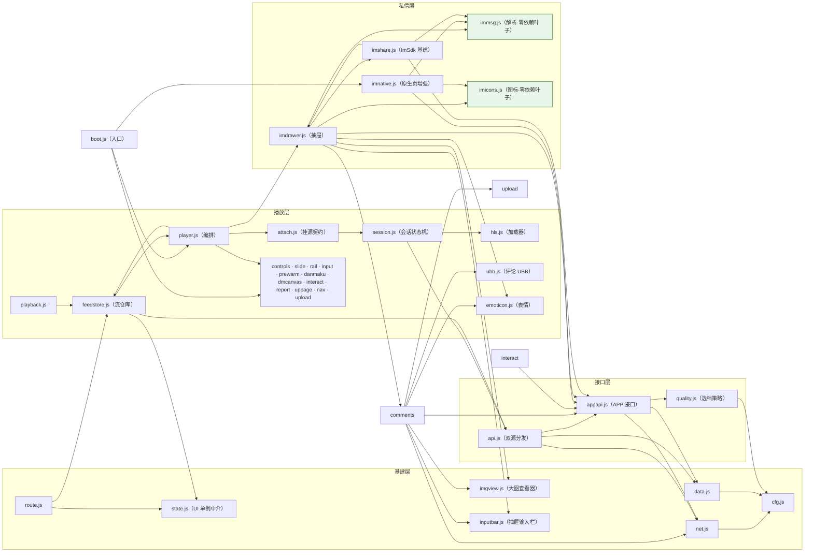

# AcFun 小视频 · PC 站竖刷页（油猴脚本）

在 **www.acfun.cn（PC 网页端）** 加入「小视频」入口，打开全屏抖音式竖滑信息流。
支持**双内容源**（竖刷页顶栏切换）：**小视频**（meow 接口，竖版短视频）与 **推荐**
（APP 首页推荐流，普通视频投稿，带弹幕/清晰度切换/收藏/投蕉），浏览与播放均**无需登录**。

## 安装

1. 浏览器安装 [Tampermonkey](https://www.tampermonkey.net/) 扩展；
2. 任选其一：
   - **直接安装**：打开 [最新版 acfun-svfeed.user.js](https://github.com/name-xxl/acfun-svfeed/releases/latest/download/acfun-svfeed.user.js)，
     Tampermonkey 会自动弹出安装页；
   - **手动**：新建脚本，把 `acfun-svfeed.user.js` 的内容整个粘贴进去保存（或把文件拖入浏览器安装）；
3. 打开 **A 站首页**（`www.acfun.cn/`），顶部导航会出现「小视频」项；
   若站点改版导致首页导航没注入成功，首页右下角会出现红色「▶ AcFun 小视频」悬浮按钮作为兜底入口。
   **入口只出现在首页**（0.9.47 起）：播放页、文章页等其他页面不注入、不弹胶囊；
   但分享链接 `#svfeed`（含带 meowId 的回跳链接）在**任意页面**打开仍可进入竖刷页。

## 使用

| 操作 | 效果 |
|---|---|
| 点击导航「小视频」/ 右下角悬浮按钮 | 打开竖刷页（地址变为 `www.acfun.cn/#svfeed`，可直接收藏） |
| 切换视频时 | 地址栏自动变为 `#svfeed/<meowId>`（不产生历史记录）；刷新或直接打开带 id 的链接可回到同一条视频 |
| 鼠标滚轮 / ↑↓ / PgUp PgDn / J K / 右下角箭头 | 上一个 / 下一个视频（滚动吸附） |
| ← / →（短按） | 快退 / 快进 5 秒 |
| →（长按） | 2 倍速快进，松手恢复原速 |
| 点击画面 | 第一次点击开启声音，之后为播放/暂停 |
| 空格 | 播放 / 暂停 |
| M / 控制栏喇叭 | 静音切换 |
| F / 控制栏全屏按钮 | 全屏切换 |
| Esc / 右上角 ✕ | 退出竖刷页，回到正常站点 |
| 悬停画面底部 | 浮出播放控制栏：可拖动进度条（带时间气泡）、播放/暂停、时间、连播、倍速、静音、全屏；鼠标静止 2.5 秒自动淡出 |
| 连播开关 | 开：播完自动下一条；关（默认）：单条循环 |
| 倍速按钮 | 0.5x → 1.0x → 1.5x → 2.0x 循环切换 |
| 评论按钮 / C 键 | 展开右侧评论抽屉：真实评论列表（头像、UP 徽章、嵌套回复），头像和昵称可点击进入用户主页；切视频自动刷新，分页加载更多。**互动按源门控**：推荐模式可用底部输入栏**发表评论/回复/表情/插配图**、评论可**点赞**；小视频模式纯浏览（输入栏隐藏、点赞仅展示）。Esc 关闭顺序：大图查看器 → 抽屉 → 退出。**UBB 富文本**：表情、`[img]` 配图、`[color=#hex]` 着色均正常渲染；配图可**点击看大图**（点任意处/Esc 关闭）；**评论正文可划选复制**（右键原生复制）。**展开时视频画面等比缩放到剩余空间**（不裁画面，弹幕随画面），界面控件不缩放——底栏钉底收窄宽度，侧栏/顶栏按钮原尺寸左移避让；竖屏等满高可容的画面只平移不缩放（保持原始大小居中于剩余区域），窗口过窄（剩余空间 <50% 视口）时改纯覆盖：视频原尺寸继续播，抽屉近乎全遮，关闭即恢复 |
| 右侧红心 | **真实点赞**：登录 A 站后直接生效（自动换取 api_st 令牌调互动接口）；未登录回退本地状态并提示 |
| 头像角标 +/✓ | **真实关注 / 取消关注** UP 主（需登录） |
| 分享 | **抖音式私信分享面板**：列出最近联系人（头像/昵称/未读数，可搜索），点「分享」直接把 `标题+链接` 发进对方私信；发送成功后按钮转「捎句话」，点击直达与该联系人的聊天；底部保留「复制链接」「消息中心」。需登录 A 站（走官方 ImSdk 私信通道，加载/连接失败自动降级为复制链接） |
| 顶栏信封（私信） | **私信抽屉**：列表（联系人/未读/相对时间/搜索）↔ 聊天（气泡/**时间分割线**/**作品卡片**（封面/计数/时长，点击跳视频；自己发出的 `标题+链接` 分享消息同样渲染为卡片）/发送/失败点击重试/已读上报/**消息引用**（hover 引用按钮 → 引用 chip，摘要条点击定位高亮）/**表情收发**/**图片消息**（即拍即发、点击看大图）；自己气泡深蓝灰不刺眼）两视图；与评论抽屉**同槽互斥**（state.js 槽位协调：开一方自动收回另一方）；Esc 逐层关：大图查看器 → 当前抽屉 → 退出 |
| 打开 message.acfun.cn 私信 | **原生私信页自动增强**（装脚本即生效）：「不支持查看此消息」占位原位替换为 10001 作品卡；脚本分享消息渲染为紧凑作品卡（限宽 228px、封面裁切，原文只留附言）；引用消息补灰色摘要条并把正文剥成纯回复（与抽屉同观感，不再双份摘要）；会话列表预览改写「[分享] 标题」 |

### 推荐模式（顶栏「小视频 | 推荐」切换，选择记忆）

数据来自 APP 首页推荐流（免登录），内容为普通视频投稿，交互对齐 APP：

| 操作 | 效果 |
|---|---|
| 顶栏「推荐」 | 切到 APP 首页推荐流（立即重置数据流；logo 文案随源变化） |
| 右侧栏 | 点赞 / 评论 / **投蕉**（弹数量层：默认全灰，悬停第 N 根时 1~N 一起点亮，点第 N 根投 N；**投过即锁定变色**，状态由 `douga/info` 的 `isThrowBanana` 回填，A 站投蕉不可取消）/ 分享，图标取自视频页原生资源（加载失败回退内置 SVG） |
| 控制栏「弹」 | 弹幕开关（记忆状态）；Canvas 渲染，滚动/顶部/底部弹幕 + 轨道防重叠，暂停/seek/倍速自动正确 |
| 控制栏「发弹」 | 抖音式内嵌输入框横向展开（点外部/Esc 收起），发送到当前进度（网页 Cookie 鉴权需登录），成功后本地即时回显 |
| 控制栏清晰度 | 360P~1080P60 多档（m3u8 + hls.js 懒加载），切换保留播放进度，档位记忆 |
| 控制栏「编码」 | 编码偏好：自动 / H.264（**默认**）/ HEVC。cast 档位不带编码字段，脚本从各档 m3u8 文件名嗅探（实测标记形如 `h264_60`/`h264_6m`）；默认滤掉 HEVC 档——部分 Chromium 无 HEVC 硬解，是 60fps 档卡帧主因；HEVC 档在清晰度菜单带 `·HEVC` 后缀；切换保留播放进度 |
| 控制栏「缓冲」 | 前向缓冲档位：标准 60s / **加大 180s（默认）** / 极限 480s，网络抖动更不易饿死；切换保留播放进度，档位记忆 |
| 控制栏评论 | 评论入口（sourceType=3，普通视频），评论条目可点赞 |
| 播放直链链路 | ac号 → `douga/info` 拿 videoId → `playInfo/cast` 拿全档直链（http 强制转 https） |

界面设计借鉴快手网页版（new-reco）：封面模糊延伸的氛围背景、扁平白色图标操作栏、右下角切换箭头、悬停播放控制栏。

## UP 主空间页的小视频标签

在 `www.acfun.cn/u/<uid>` 空间页的内容标签栏（视频/文章/合辑）末尾自动加一个「小视频」标签
（PC 端空间本来不展示小视频），浏览体验对齐视频投稿标签：

- **自动加载**：后台按游标链顺序拉取该 UP 的小视频（每页 10 个、间隔 30ms 防压；默认最多自动拉 20 页，
  可在 `src/cfg.js` 的 `up.maxChainPages` 调整），左上角实时显示"已加载 N / 总数"，达到上限会明确提示；
- **页码分页浏览**：底部页码条（窗口式页码 + 省略号），未加载到zhi的页码置灰，后台加载到即自动点亮；
- **最新 / 最热筛选**（右上角下拉，样式仿站点排序）：最新=接口顺序（时间倒序）；最热=逐个拉取
  meow/info 统计点赞数后重排（渐进完成，进度实时显示，切回最新恢复原序）；
- 点击封面直接以竖刷模式打开该视频（`#svfeed/<meowId>`），**后续按主页列表顺序**依次播放
  （空间页后台继续加载，列表追完后回落随机推荐流），Esc 退回空间页。

数据抓自 m 站 upPage 的 pagelet 接口（`userId&type=6&pcursor=<时间戳>`，返回 BigPipe HTML），
**必须在 Tampermonkey 下运行**（依赖 GM_xmlhttpRequest 跨域，浏览器直连会被 CORS 拦截）。
注意：接口本身不支持排序参数（实测 sort/order 均被忽略），最热排序为客户端统计实现。

## 说明与限制

- 接口：`POST https://m.acfun.cn/rest/mobile-direct/meow/feedList`（信息流）、
  `POST .../meow/info?meowId=<id>`（单视频详情，用于直链过期后刷新）、
  `GET https://www.acfun.cn/rest/pc-direct/comment/list?sourceId=<meowId>&sourceType=5`（评论列表，
  小视频在通用评论系统里的 sourceType 是 5，免登录；评论头像 headUrl 是 `[{cdn,url}]` 数组）。
  优先走 `GM_xmlhttpRequest`，未授权时回退 `fetch`。
- 操作栏图标：推荐模式的赞/藏/蕉用视频页原生图标做 CSS mask（借形状换色：未激活白色 →
  激活 A 站红 `--acsv-accent`，投过蕉锁定蕉黄）；小视频模式的赞用小视频站原生 PNG。
  评论/分享取自 AcFun 小视频页面自带资源（ali-imgs CDN 的 PNG）。内置 SVG 仅为
  CDN 资源加载失败时的回退。
- feedList 是随机推荐池（无翻页 cursor，m 站"下一条"也是同一接口、每批 5 条），脚本内按 `meowId`
  去重后拼接成无限流；刷新页面时若地址带 `#svfeed/<meowId>` 则先加载该条，否则重新随机。
- 视频直链带签名（约 7 天有效），播放失败时自动换备用 CDN → 刷新详情 → 手动重试。
- 每个小视频只有**单一档位**的直链（播放接口不提供清晰度切换）：清晰度取决于该视频上传时平台转出的源文件，
  新一些的视频多为 720p（横屏 1280×720 / 竖屏 720×1280），2018 年前后的老投稿常见 720×480。
  已实测 `meow/info` 与 `feedList` 对同一 ID 返回完全一致的 playInfo，无隐藏的高清参数；
  App 端 `api-new.app.acfun.cn/rest/app/meow/info` 需登录 api_st（未登录返回 result 105001）。
- 真实互动接口（需登录 www.acfun.cn）：
  点赞 = `POST id.app.acfun.cn/rest/web/token/get`（sid=acfun.midground.api，带 cookie）换 api_st →
  `POST api.kuaishouzt.com/rest/zt/interact/add|delete`（objectId=<meowId>&objectType=2&interactType=1&subBiz=mainApp&kpn=ACFUN_APP，成功返回 result=1）；
  关注 = `POST www.acfun.cn/rest/pc-direct/relation/follow`（toUserId&action=1/2，成功 result=0）。
  两接口 CORS 均放行 www.acfun.cn，页内 fetch 带 cookie 即可。
- 私信分享（需登录）：网页端私信**没有 REST 发送端点**，官方自己走快手 ImSdk
  （klink WebSocket + protobuf，CDN 地址取页面 `globalConfig.imsdkcdn`）。脚本加载 SDK 后
  `new ImSdk({dev:false})`——构造是单例，与站点顶栏未读红点实例共用同一条 WS 连接；
  鉴权 `POST id.app.acfun.cn/rest/web/token/get`（sid=acfun.midground.api，同点赞令牌），
  最近联系人 = `kernel.getSessions()`（按最近消息排序）+ `getUserCardList` 补头像昵称，
  发送 = `sendMessage(targetId, text)`（纯文本 ≤1000 字，成功有回调、失败无回调需超时兜底）。
  全链路任一步失败自动降级为复制链接。

### 推荐模式接口（api-new.app.acfun.cn，与 acfunchina.com 同后端互通）

- 首页流：`POST /rest/app/selection/feed?product=ACFUN_APP&app_version=6.31.1.1026&appMode=0`，
  body `mkey=<固定token>&pcursor=<游标>&count=10`；**必须带 APP 请求头**
  （acPlatform=ANDROID_PHONE、appVersion、productId=2000、udid、requestTime 等，UA 用
  `acvideo core/...` 设备格式），缺了报 result 21；selection/feed 必须带 appVersion 头，
  douga/playInfo 不带。mkey 是客户端硬编码 token，免登录免签名。
- 详情：`GET /rest/app/douga/info?dougaId=<ac号>&mkey=` → `videoList[].id` 即 videoId，
  附 channel（发弹幕的 subChannelId/Name 取 channel.parentId/parentName）、全套计数、
  isLike/isFavorite 初始状态。
- 播放：`GET /rest/app/play/playInfo/cast?videoId=&resourceId=<ac号>&resourceType=2&mkey=` →
  streams[] 按清晰度降序（1080P60…360P，各 2 个 CDN），playUrls 为 http m3u8，
  前缀直接换 https 可用（实测 200）；Chromium 需 hls.js（GM_xhr 拉 jsdelivr 后 Function 执行，
  不吃页面 CSP），Safari 走原生 HLS。streams[] 不带编码字段，且每档是单变体 media playlist
  （无 #EXT-X-STREAM-INF 变体），编码维度只体现在 m3u8 文件名标记里（如 `h264_60`/`h264_6m`），
  脚本据此嗅探并支持按偏好过滤档位（`cfg.codec`）。
- 弹幕：全量 `POST www.acfun.cn/rest/pc-direct/new-danmaku/list`
  （resourceId=<videoId>&resourceType=9&pcursor=1&count=200，网页 Cookie，pcursor 翻页）；
  发送 `POST www.acfun.cn/rest/pc-direct/new-danmaku/add`
  （body/color/mode=1/position=<ms>/id=<ac号>/videoId/subChannelId/subChannelName/type=douga）。
- 收藏/投蕉/评论点赞：`POST /rest/app/favorite`（resourceId&resourceType=2）、
  `/rest/app/unFavorite`（resourceIds=…）、`/rest/app/banana/throwBanana`（count 1~5）、
  `/rest/app/comment/like|unlike`——.acfun.cn 域 Cookie（GM_xhr 自动携带）+
  `acfun.midground.api_st` 双保险；**写接口的登录态有效性需在 Tampermonkey 下实测**。
- 弹幕 mode：1=滚动、4=底部、5=顶部；颜色为十进制 int（16777215=白色），position 为毫秒。

## 冻结归因实验（0.9.7+，仅 debug 构建）

「最小化回来画面冻结、音频正常」的归因用控制变量法：**同一浏览器同一视频，每轮只改一个条件**，
跑 5 轮最小化往返（等 30 秒再回来），记录冻/不冻。实验开关写入 `localStorage['acsv-exp']` 后
重开信息流生效（清除：`localStorage.removeItem('acsv-exp')`）：

| 轮次 | 操作 | 验证什么 |
|---|---|---|
| 0 对照 | A 站主站播放页打开同一视频，同样最小化往返 | 坐实差异在脚本栈 |
| 1 基线 | debug 版默认设置 | 复现冻结 |
| 2 锁档 | 清晰度菜单手动锁 720P（`_qManual` 置位） | 顶配/60fps 解码负载因素 |
| 3 `{"q30":1}` | 滤掉 60fps 档 | 同上（不动 `_qManual`） |
| 4 `{"noMonitor":1}` | 跳过看门狗 | 顶针/rME/降档动作本身致冻 |
| 5 `{"noWorker":1}` | 关 hls.js 转封装 worker | worker 后台往返问题 |
| 6 `{"smallBuf":1}` | 缓冲缩到 std 档 | 大缓冲内存压力因素 |

读数（控制台，TM 下请用第二种）：
```js
__ACSV_TEST__.getStats()                          // 页内/harness 环境可用
JSON.parse(localStorage.getItem('acsv-stats'))    // TM 环境兜底（debug 版每秒镜像，取 .stats 字段）
```
- `vis.framesBackMs`：回前台到首个真实帧的耗时。**反复 >2000ms = 真楔死**（看门狗该出手）；
  **反复 <1000ms 却仍判冻 = 监视器误判（脚本锅实锤）**；
- `hls.levelCodec`：实际播放编码（avc/hevc + fps）——确认有无 HEVC 泄漏；
- `stall.tailReattach`/`session.dispose` 增长 = 看门狗在自救。

判定：`q30`/锁档有效 → 顶配解码负载（后续改默认档策略）；`noMonitor` 有效 → 看门狗动作致冻；
`noWorker` 有效 → worker 问题；`smallBuf` 有效 → 内存压力；全无效且 `framesBackMs` 大 →
环境级（GPU/驱动/Chromium 版本），脚本无责收尾。

## 更新日志

### 0.9.50（2026-10-01）· 评论转发到私信（官方无此入口，脚本补位）

- **背景**：实测 A 站两端都没有「分享评论到私信」入口（PC 评论无分享按钮、APP 分享
  面板无私信项），但有「转发评论到动态」——产物为普通转发型动态，评论内容以
  `附言//[at 评论作者]@昵称[/at]：评论原文` 形式内嵌正文、无结构化字段（样本
  am5100598 实证）。私信侧脚本补位。
- **交互**：评论操作行（点赞/回复旁）新增「转发」文字按钮（仅推荐模式，与回复同门控，
  楼中楼同享）→ 弹 imshare 好友分享弹层（标题「转发这条评论」，挂抽屉根锚输入条上方，
  复用搜索/最近联系人/发送/捎句话全链路）→ 选人发送。
- **消息格式**：`@评论作者：评论纯文本\n作品链接`——对齐官方动态转发格式并适配
  parseShare 契约（标题行\nURL）：对端官方 APP 收到可读纯文本，脚本抽屉两端自动出
  分享卡。分享弹层 `openSharePanel` 加 `opts`（`host` 挂载点/meta 行在滚动列表内挂载
  会被水平裁剪、`popClass` 位置修饰、`headText` 标题文案），rail 分享不传保持原状。
- **`ubb.ubbPlainText`**：UBB → 纯文本投影（表情/配图转 `[表情]`/`[图片]` 占位，at/
  resource/color 摘内文），标签清单与 renderCommentHtml 镜像、处理顺序一致，供私信
  文本用（不进 HTML 故不做 esc）；单测 +9 例。
- **模块环**：comments→imshare→imdrawer→comments 成环（评论侧弹私信面板），两侧均
  函数、调用期才解引用，feedstore↔player 同款先例。
- **提交说明**：本版本与未入库的 0.9.49（私信图片懒加载，同文件 imshare.js 叠加）一次
  提交，git log 按先例注明。

### 0.9.49（2026-10-01）· 私信图片渲染提速 + 抽屉打不开修复

- **修复 0.9.48 回归：私信抽屉无法展开**——`ensureDrawerDom` 改用 `buildQuoteChip`
  工厂后返回值从元素变成了 `{box,label}` 对象，`chatView.appendChild(quoteChip)` 漏加
  `.box`，开抽屉必抛 `TypeError: parameter 1 is not of type 'Node'`，`drawer` 赋值走不到、
  抽屉永远建不出来（评论侧 `appendChild(replyChip.box)` 写法正确，仅私信侧漏改）。
- **问题**：图片气泡等待久，四因叠加——下载的是原图（`officialize` 沿官方抓包白名单
  剥 w/h，几 MB 原图只用 180px 展示）；`fetchImImageBlob` 每次拼 `?_=Date.now()` 击穿
  浏览器缓存且 blob/objectURL 零复用、从不 revoke（重开/切会话全量重下 + 持续泄漏）；
  历史消息一次性全量并行拉取（进会话 N 个 GM 请求抢带宽）；首图串行等 token/get 往返
  且加载中无任何提示。
- **LRU 缓存**（imshare.js）：blob objectURL 缓存上限 30 条、淘汰即 revoke——重开/来回
  切会话命中秒显，顺带修掉泄漏；**key 取 resourceId 资源本体而非整串 URL**：重开会话
  内核换链可用性不定（0.9.41「零会话依赖三级兜底」同款前提），内核形态与本地拼装两条
  路的 URL 参数不同，整串做 key 互不命中——真机首验「非秒出」的根因；缓存查询在令牌
  之前，命中连 token/get 都省；在飞去重让「加载中点开大图」共享同一次下载。
- **首拉不再击穿 HTTP 缓存**：`?_=` buster 只保留在令牌强刷后的重试路（防命中可能
  已中毒的缓存响应），首拉裸 URL 让浏览器缓存跨页面刷新生效。
- **懒加载**（imdrawer.js）：图片气泡滚入视口（viewport root + 200px rootMargin 预读，
  祖先滚动容器裁剪自动计入）才拉字节，长历史只加载可见几张；并发上限 3（FIFO 队列）
  防快滚挤爆带宽。
- **令牌预热**：新增 `prewarmIm()` 挂在 `openDrawer`/`openChat`——开抽屉即单飞换好
  midground 令牌写好 Cookie，进会话首图不等 token 往返。
- **加载感知**：接收侧复用发送侧 `.pending` 类 + 新增 shimmer 微光扫过动画
  （`acsv-im-shimmer`，`position:relative` 随之入图片气泡基规则）；**缓存命中在渲染时
  同步上屏**（`peekImImageBlob` 只读窥缓存，不闪微光、不等 IntersectionObserver 一拍）；
  大图查看器改走 `fetchImImageBlob`——缓存命中秒开，blob 被 LRU 淘汰 revoke 后自动
  重拉（直用渲染时 curSrc 有潜在裂图面）。
- 不变量：下载尺寸仍是原图（缩略图资源探查需真机 proto dump，另行立项）；失败仍降级
  「[图片]」文本；发送侧乐观气泡与 `revokeObjectURL` 逻辑不动。

### 0.9.48（2026-10-01）· 评论回复提示复用私信引用 chip

- 评论的回复目标此前是**输入条栏内红药丸**（`.acsv-creply`，整颗可点取消），挤占输入行、
  长昵称把输入框压窄；私信的引用提示（输入条上方独立一行：label 左对齐自动省略 + 右侧
  独立 ✕）观感明显更合理，按用户拍板两 drawer 统一为后者。
- **收敛 `inputbar.buildQuoteChip(onCancel, xTitle)`**：私信引用 chip 的 DOM 工厂化
  （`div.acsv-quotechip` = label + ✕，沿用 0.9.41 输入条收敛先例——共用组件保留一侧
  前缀，类名去 `im-` 中性化）；`imdrawer.renderQuoteChip` 由每次重建子节点改为只回填
  label 与显隐。
- **评论侧** `setReply`：提示条置输入条上方（`replyChip.box` 先于 `inputBar` append），
  label「回复：@昵称」/ placeholder「回复 @昵称…」与私信「引用：摘要」/「回复引用的
  内容…」同构；发送成功/切视频清目标逻辑不动。`buildInputBar` 的 `opts.chip` 参数随
  栏内药丸一并退役。
- **CSS**：`.acsv-im-quotechip*` → `.acsv-quotechip*` 四条规则重命名共用；`.acsv-creply`
  删除，RAW_CSS 头部「alpha 形态主题色不换肤例外」注释随之失效一并清理（grep 证实再无
  alpha 形态残留）。
- 行为差异：取消回复从「点整颗药丸」变为「点右侧 ✕」（与私信一致）；表情面板
  `bottom:57px` 锚定不变，提示条在场时面板会盖住提示条——私信既有行为，保持一致。

### 0.9.47（2026-10-01）· 小视频入口收窄为首页白名单

- **问题**：导航注入此前在 `www.acfun.cn` 全站每页盲试——先找白名单标签链接克隆
  「小视频」项，6 秒（`navWait`）仍失败就弹右下角兜底胶囊。于是播放页等非首页处
  只要导航渲染慢/结构不匹配，胶囊就会弹出来，且一旦创建永不撤销。
- **修复**：`cfg.nav.pages` 页面白名单（pathname 正则数组，0.9.47 起 `[/^\/$/]` 仅
  首页），`watchNav` 开头加闸门——白名单外不注入、不起 MutationObserver、不挂 6 秒
  兜底定时器，整条链路直接短路；原 `/u/` 个人空间特判被白名单覆盖，删除。
- 兜底胶囊**保留**：仅首页注入失败（站点改版）时仍会弹出，README 承诺的改版兜底能力不变。
- 不受影响：`#svfeed` 路由（route.js）仍全页面响应——分享链接、带 meowId 回跳链接在
  任意页面打开仍可进竖刷页；空间页 `/u/` 的「小视频」标签注入（uppage.js）是独立功能不动。

### 0.9.46（2026-10-01）· 评论点赞/回复图标换用 A 站原生形状

- 评论操作按钮此前是手绘 Material 心形 SVG + 纯文字「回复」，与同页右侧操作栏的
  原生图标风格不统一。
- **点赞**：照搬 rail.js「原生图标只借形状」模式——CSS mask（`.acsvg-cicon`
  currentColor 染色）+ `new Image()` 探测、CDN hash 失效回退手绘 SVG；形状跟随同页
  操作栏选型：推荐页用视频页拇指 SVG（`VIDEO_ICONS.like`），小视频站用心形 PNG
  （`SITE_ICONS.heart`）。楼中楼走同一 `commentItem()` 自动跟随。
- **回复**：补上原生评论气泡 PNG（`SITE_ICONS.comment`）+ 文字，`inline-flex` 排版，
  hover 变色由容器 `color` 驱动自动跟随。
- **CSS**：`.acsv-clike` 状态色（灰 → hover 亮灰 → `.on` 主题红）从 `svg fill` 三处
  规则收敛为容器 `color` 驱动，mask/回退两条渲染路径共用；无行为改动，点赞乐观更新
  与回滚逻辑不动。

### 0.9.45（2026-10-01）· 切清晰度「隔一两个视频才生效」修复

- **根因**：清晰度偏好只在条目解析时经 `applyQuality` 应用一次（appapi.js），解析完
  `ensureResolved` 即短路永不再算；而手动切档时 idx+1 已被渲染窗口预挂（旧档会话在跑）、
  idx+1/idx+2 已被 prewarm 按旧偏好解析完（qIdx 冻结）——新偏好要等划过这两条、到
  idx+3 现解析才生效。0.9.43 给编码/缓冲菜单补过同族邻居重建，清晰度菜单漏接。
- **修复**：`switchQuality(manual)` 尾部新增 `syncFwdQuality`——idx+1/idx+2 从
  `_qualitiesAll` 还原全集本地重选档（新导出 `reapplyQuality`，不重走网络、防二次收窄）；
  idx+1 有预挂会话则保进度（`_resumeAt` 槽位）dispose+attachVideo 重建，`_qBtn` 文本由
  直挂快路径的 onResolved→onHomeResolved 连带刷新；idx+2 无 slide 划到时按新档挂载。
  后向不动（已看内容重建丢位置）；自动降档不跟随（本机临时补救，不写偏好）。
- **编码菜单同族补漏**：`rebuildFwdNeighbor` 的 dropCache 此前只作废 idx+1，prewarm 的
  idx+2 仍旧编码过滤档位，一并作废（controls.js）。
- **加固**：清晰度菜单在解析中/错误态（无 video）点击由静默早退改为 toast 提示。
- **测试**：feed 快照补 qIdx/qLabel 字段；harness quality-switch 场景新增三条断言
  （预挂条会话重建 dispose+2 / items[1][2] qIdx 跟随 / label 同步），连同 smoke、
  homeswitch、prewarm、fastswipe 五场景全绿。

### 0.9.44（2026-10-01）· 全库注释/文档对齐 + 两处顺手修复

- **空间页徽标修复**：0.9.36 `el()` 改 textContent 语义的漏网点——「小视频」标签的 HTML 串
  被当纯文本（字面显示 `小视频<span>0</span>`），且计数 span 选择器恒空、标签页徽标总数失效；
  改走 `elHtml()`（uppage.js）。
- **恢复链末级重挂丢进度修复**：看门狗阶梯走到 tailReattach（锁档/到底档场景）时进度写进了
  旧会话对象，而 attachVideo 只认 `slide._resumeAt` 传输槽位 → 重挂后从头播放；改写槽位
  （session.js）。
- **死码清理**：danmaku.rebind（零调用，图层重建由 dispose+onPlaying 覆盖）、cfg.codec.reAvc、
  cfg.api.appBase（零消费）。
- **src 注释全库校对**（43 模块逐文件通读）：attach.js 契约总表六组读写方按 grep 实证修正、
  抽屉骨架/委托挂载点归属 slide.js、弹幕发送框常驻语义、hls.js 内嵌主路径、appapi 读写接口
  收口表述、exp 开关补 native 键等约 20 处；imgview/emoticon 抽离的版本归属统一为 0.9.41
  （inputbar.js 头注释自证 + 更新日志，源码三处 0.9.40 系笔误）。
- **README 校对**：私信/评论抽屉同槽互斥（「并存」系 0.9.19 前旧表述）、Esc 关闭链更正、
  私信能力清单补引用/表情/图片、评论互动按源门控表述、操作栏图标 mask 方案、依赖图补
  `imshare→immsg`/`comments→upload` 边、模块职责表补全 11 个播放层文件、npm scripts 描述。

### 0.9.43（2026-09-30）· 原生页引用去重加固 + 自证日志

- **贴界 `<br>` 残留修复**（0.9.42 实缺陷）：实测结构里换行渲染成 `<br>`（不产生文本，
  textContent 换行必丢），正文子节点是 `[文本节点(前缀), <br>, 文本节点(回复)]`——
  0.9.42 的剥离循环在文本节点耗尽前缀长度后即停手，`<br>` 留下，剥完变「空行+回复」。
  现在到达边界后顺手摘掉贴界零文本节点，遇首个非空节点收工（回复自身多行的 `<br>`
  不误伤）；另兼容官方把正文排进唯一包裹元素的形态（下钻一层再走）。
- **自证日志**（0.9.29 教训第三次生效：「依赖用户侧重装的验证必须自证新代码在跑」）：
  构建注入 `__ACSV_VERSION__`，挂载行带版本号 `[acsv-im] 原生页增强挂载 v0.9.43`；
  剥离成功打 `引用正文剥离 wire 前缀 n 字`，失败（拼接形态未识别 / DOM 跨界）各打
  一条带正文前 80 字样本的 info——「为何没剥」远程可判读，不再静默。

### 0.9.42（2026-09-30）· 原生页引用去重：剥掉正文里的 wire 拼接前缀

- **根因**（用户截图逐字吻合）：extra 通道（默认）引用消息的 wire 可见文本是发送侧
  拼接的「`[引用] 摘要\n回复`」（给 APP 端纯文本可读性的契约，不能改）。原生页官方把
  这条文本消息整段渲染进气泡正文，脚本引用分支又按 extra 里的 `acsvQuote` 在正文上方
  补灰色摘要条——摘要出现两份；嵌套引用时呈 `[引用] [引用] …` 叠加。
- 修复：`immsg` 收口 wire 拼接唯一定义处（`quoteWirePrefix/quoteWireText`，发送侧
  `sendQuote` 改同一来源），新增 `quoteWireTrimLen` 判定官方正文恰为发送侧拼接形态
  （前缀命中 + 余部剥前导空白后精确等于回复正文；`\n` 保留/`<br>` 丢失/空白折叠三
  形态均命中）；`imnative` 补摘要条前外科手术式剥离前缀（文本节点跨界切片，元素跨界
  预检后整体放弃全有或全无），官方对回复部分的链接/表情渲染原样保留；形态不识别
  （type 12 等）维持只补条不动正文的兜底。原生页观感对齐抽屉：引用条 + 纯回复。
- 契约测试补位：发送侧 wire 格式此前零测试覆盖，本次 `quoteWireText/quoteWireTrimLen`
  全形态钉死（命中三形态、四类不匹配、preview 缺省「原消息」、脏输入容错）。

### 0.9.41（2026-09-30）· 私信表情与图片：官方同路消息 + 输入条 UI 抽离

- **输入栏收敛 `inputbar.js`**：评论/私信底部输入栏此前各自一份（`.acsv-cinput*` /
  `.acsv-im-*`），观感漂移（textarea 圆角 8/10 不一、发送键一药丸一圆角矩形、自动增高
  只有评论有）。`buildInputBar(opts)` 统一为同一套 DOM/CSS/行为——评论侧零迁移（沿用
  `.acsv-cinput*` 类名与既有 querySelector 引用），IM 侧补齐自动增高、Esc 失焦、发送键
  药丸形；差异语义（回复药丸 chip、图片按钮行为、placeholder/maxLength、onSend）参数
  注入。IM 侧重复样式（`.acsv-im-inputbar/-input/-send/-emot/-imgbtn`）退役。

- **表情**：官方 IM 的表情就是 TEXT 消息里的 `[emot=acfun,ID/]` 短代码（SDK 内
  `convertEmotionCodeToHtml` 收发双向转换，APP/官方 web 原生渲染）。输入条加表情按钮，
  面板复用 emoticon.js（插 UBB 代码混排进文本）；气泡渲染 esc+linkify 后追加短代码转图
  （EmotionMap 直查 → umeditor 老图兜底 → 「[表情]」文本兜底，与官方同构）；列表预览
  统一显示「[表情]」。抽屉创建即预热 EmotionMap，避免没开过面板时表情只出文本。
- **图片**：IMAGE 消息（contentType 1，官方同路）——`ImageMsg.create({image: File})` 走
  `kernel.sendMessage`，SDK beforeSend 自动上传图床换 `ks://` 资源串，APP/官方 web 原生
  渲染。**不能发 https 直链**：官方端渲染非 ks:// 资源会 throw，打断整个会话渲染循环。
  即选即发（微信/抖音 IM 惯例）：读自然宽高 → 乐观占位（本地预览）→ `sendImage` → 成功
  摘占位补真身 / 失败点击重试。收图 `msg.url`(ks://) 经 `kernel.file.resourceUrlToHttpUrl`
  换链渲染，宽高按比例占位；点击开大图查看器。确认走 clientSeqId 对账（`sendKernel`
  兼容上传期间 clientSeqId 晚赋；超时 `CFG.im.imgSendT=60s`，上限 `CFG.im.imgMax=10MB`）。
- **UI 抽离**：大图查看器迁出 `imgview.js`（评论/私信共用，comments/input 改 import）；
  表情按钮三件套（toggle+懒加载+光标插入）抽 `emoticon.mountEmotButton`，两处输入条
  去重。表情面板样式 `.acsv-emot*` 本就无作用域，私信抽屉内锚定零覆写（bottom:57px 恰
  对齐 IM 输入条）。
- 图片消息可被引用（`isQuotable` 加 ct 1，预览「[图片]」；ImageMsg 已注册，两条 wire 通道皆安全）。
- **缓冲档位降流量**：标准/加大/极限的前向缓冲 60/180/480s → **10/20/30s**（maxMaxBufferLength
  与 maxBufferSize 等比收缩；backBufferLength 保持原值——回退缓冲不产生前向流量，调小反而
  会让回拖进度条重新下载）。档位记忆键不变，已选档用户自动落到新值。
- **编码/缓冲改动同步重建前向预挂条**：这俩是 hls 构造参数、仅会话创建时读取，预挂的下一条
  带旧实例继续跑（相邻划走只 pause 不 dispose），此前「间隔一条才全部生效」。现在改动瞬间
  邻居 item 会话重建（编码改动连带作废其清晰度链缓存）；后向邻居是已观看的暂停内容，
  重建丢播放位置，不动。
- **图片发送卡死修复**（真机定位）：站点 globalConfig 供给的旧版 SDK（rc.1）link 对象缺
  `log/logPerformance` 方法，图片上传成功后的性能打点走 `kernel.log → this.link.log` 直接
  TypeError，发送整体失败（文本路径不经此打点故长期未暴露）。`ensureTracer` 双侧补 no-op
  桩（与补 tracer 同族手术，只丢埋点）；诊断中同时排除了 CORS——上传端点预检明确放行
  www.acfun.cn，上传 POST 实测 200。
- **图片渲染域改写 + GM 兜底**：内核换链产物指向远端配置下发的 apiAddress
  （sixinpic.kuaishou.com，实测对 acfun token 401）；改写为 message.acfun.cn 官方参数形态
  （白名单 resourceId/userId/did/kpn/imsdkver/platform，剥 token 与 w/h——官方页同资源该
  形态实测 200）。下载端按 Cookie 里的 midground 令牌鉴权（直链跨站没这张 Cookie 必
  401，query 带令牌实测不认；官方页 DOM 实锤 ks:// 形态 = resourceId + 数字尾缀）——
  GM 拉字节前先 id.app.acfun.cn token/get（sid=acfun.midground.api）现换令牌写进
  .acfun.cn 父域 Cookie（本页可写父域，message.acfun.cn 无 host 级同名时即采用），
  被拒强刷重试一次；失败降级 [图片] 文本（gmRequest 增 arraybuffer、
  `@connect message.acfun.cn + id.app.acfun.cn`）。
  渲染链**零会话依赖**：uri 取 m.url → rawMsg.content 手解 proto 字段 1（重开会话内核
  decodeContent/file 配置不保证就绪，「装后首开能渲染、重开失败」的根因）；URL 内核换链
  失败时本地拼装（ks:// 尾段 resourceId + 本端 Cookie userId/_did）。
- 与 0.9.40 评论配图修复零交集：那条链路产出签名 https URL 供 comment/add 改写落库，
  私信图片走内核上传产 ks:// 资源串，各走各的管线。

### 0.9.40（2026-09-30）· 评论图片修复：上传 URL 保留签名参数（服务端靠它改写长期地址）

- **根因**（用户实测 DevTools 载荷 vs add 回显对比实证）：`comment/add` 服务端解析
  content 里 `[img=图片]` 的完整签名 URL（`preview.ndcsk.com/ksc2/…?pkey=…&imgId=…`），
  把它改写成 `imgs.aixifan.com/newUpload/{uid}_{hash}.png` 再落库；脚本此前在
  `upload.js` 剥掉 `?` 后参数只发裸 ksc2 路径，服务端解析不到图，**整条 content 被
  清空**——评论成空壳，原网页与脚本抽屉都渲染不出。
- 修复：`uploadGetUrl` 原样返回 `getUrlAfterUpload` 的完整 URL；`IMG_CDN_OK` 白名单
  补 `preview.ndcsk.com/ksc2/` 分支（host+path 双锚定，裸路径公开可访问已验证），
  兜底服务端未改写的旧内容。
- 附带：评论输入框 `maxLength` 233→1000——配图代码 450+ 字符，限 233 时插入图片后
  输入框锁死打不了字（用户被迫发纯图评论的次生原因）。

### 0.9.39（2026-09-30）· 私信消息引用：原生 Reference 双通道 + 摘要条/定位 UI

- **双 wire 通道**（`CFG.im.quoteWire` 切换，默认 `extra`）：
  - `extra`：文本消息 + proto extra 字段藏 `{acsvQuote:{seqId,preview,text}}`，对方
    客户端只看到「[引用] 摘要\n正文」可读文本，零兼容风险。
  - `reference`：原生引用消息（contentType 12，内核已注册 `ReferenceMsg`，编解码全由
    SDK 承担，收到的消息自带 `.text` + `.originMsg`）。绕过 widget 文本/图片白名单走
    `kernel.sendMessage` 直发（`imshare.sendKernel`），确认改为会话缓存里按
    clientSeqId 对账（内核直发没有「信息发送成功」日志）。**2026-09-30 真机实测**：
    服务端接受（消息正常落地、web 端渲染正常），但 AcFun APP 端不渲染、提示「客户端
    不支持查看此消息」——降为保留通道，APP 后续支持引用了再切回。
- **解析层**（`immsg.js`，两通道统一消费为 `{seqId, preview, text}`）：`quoteOf`（type 12，
  originMsg 缺失降级不弃疗）、`quoteExtraOf`（extra 翻 acsvQuote）、`isQuotable(m, wire)`
  （文本/卡片/引用套引用可引；图片与未知类型无有效预览不给入口；`wire='reference'` 时
  卡片例外——内核 decodeContent 重建 originMsg 查表 `new`，10001 未注册会崩）； 
  `previewOfMessage` 引用分支优先于分享/链接。
- **抽屉 UI**（`imdrawer.js`）：文本/卡片/分享卡气泡 hover 出「引用」按钮（行包裹器
  `.acsv-im-rowwrap` 承接，mine 行反序；卡片行宽度上收到包裹器避免 % 宽循环解析；
  reference 通道卡片无按钮）；输入条上方引用 chip（复刻评论抽屉 acsv-creply 交互，
  placeholder 联动）；发送失败点击重试会恢复引用 chip；引用气泡=摘要条（黑系内嵌+
  主题红细左边线+单行省略）+ 回复正文，点击摘要条按 originMsg.seqId 定位原消息
  （`chat.msgEls` 登记锚点 + flash 描边高亮）。引用判定先行于卡片/分享——回复正文带
  链接依然是引用气泡。
- **原生页**（`imnative.js`，只读）：type 12 占位形态整条替换（摘要条+正文进 Shadow
  DOM）；官方能自行显示正文的形态则只在正文上方补摘要条；列表预览与抽屉同源。
- **恢复逻辑泛化**：`sendOnce` 的失败恢复（tracer 重建/重连/forceSync）抽成
  `withSendRecovery(inst, send)`，文本与引用发送共用，doSend 路径行为不变。
- 随版本带入上一轮工作区成果：评论 UBB 补 `[at uid=N]`/`[resource id= type=]` 规则
  （对齐动态广场方言，`CFG.api.articleBase` 配套）；私信气泡开文字选择（划选后原生右键
  复制，退役 `.sent` 类与按文本对账的占位移除块）；`ubb.test.js` 单测落库。

### 0.9.38（2026-09-30）· P2-d 契约收口：upload 迁出 / CFG 纪律补漏 / dataset 投影登记

- 图片上传四阶段迁出 appapi → `upload.js`（接口层只留读/写接口与互动）；
  getToken/getUrlAfterUpload 两个内联端点入 `CFG.upload`。
- CFG 纪律补漏：表情最近使用键名入 `CFG.lsEmotRecent`；"10MB" toast 文案改由
  `CFG.comments.imgMax` 推导（`slice(0,12)` 双写已在 0.9.36 随拆分消除）。
- 「非当前即暂停」谓词收敛为 `playback.offCurrent`（setActive 窗口扫描与
  sweepVideos 幽灵扫描共用，判定改一处即三处生效）。
- attach.js 契约总表补 **dataset 投影节**（data-state/paused/drag/idx/panfit 的
  读写方）——dataset 与 `_xxx` 并行的第二协作面此前在表外。
- **有意不做**：paginate 通用分页泵——danmakuList 修复后已有页数/条目数双上限且
  表意清晰，单调用点抽泵是 YAGNI；等第二个接入方出现再收敛。

### 0.9.37（2026-09-30）· P2-c 热路径效率：扫描界界化 + 观察器重建

- **setActive 暂停扫描收敛为窗口内**：video 只存在于渲染窗口的 slide 里，原全量扫
  scroller 会随会话长度线性放大（slide 元素常驻不拆）；幽灵兜底仍由 sweepVideos 负责。
- **updateArrows 传当前 slide**：长会话中 `root.querySelectorAll('.acsv-arrow-up')`
  同样线性放大；箭头显隐本就随激活重估，传参后 O(1 slide)，未传参回退全量。
- **IntersectionObserver 工厂化（makeIO）**：切源清空 scroller 后观察列表同步重建，
  detached slide 不再滞留 io 内部表（原实现滞留到卸载才释放）。
- **onFrame 死亡判定去掉逐帧 querySelector**：video 元素在会话存活期内不会被换
  （所有换绑路径都先 dispose 本会话），isConnected 足以覆盖。
- **resize 尾节流 150ms**：拖窗口时全量 syncPanFit 不必逐帧跑。
- **有意不做**：dmcanvas addLocal 增量插轨——量宽有缓存、items 近似有序，全量
  assignLanes 实测为亚毫秒级且只在用户手动发弹幕时触发，增量分配需复制贪心分配器、
  分歧风险大于收益。

### 0.9.36（2026-09-30）· P2-b 结构治理：comments 三分 + el() 语义重构 + 死契约清理

- **comments.js 三分**（692 → 约 400 行）：UBB 渲染拆 `ubb.js`（esc-first 管线 +
  IMG_CDN_OK/URL 字符集白名单），表情服务与面板拆 `emoticon.js`（EmotionMap/缓存/
  最近使用/renderEmotPanel，插入经注入回调），本文件回归抽屉编排。顺带修掉
  emotReadRecent 的 `slice(0,12)` 与 CFG.comments.recentMax 双写。
- **el() 第三参改 textContent 语义，HTML 场景另立 `elHtml()`**：全项目 60+ 调用点
  逐一分类——图标 SVG/拼 HTML 改 elHtml，纯文本统一走 el（esc() 包裹随之删除）。
  这是 0.9.33 XSS 三坑的根因治理：「不可信文本被当 HTML 传」从此结构性不可能。
  imdrawer/imnative/imshare/comments/slide 共 10 处 esc 包裹随之退役。
- **mock 死契约清理**：`item.resolved` 声明于 data.js、仅 mock 分支写、全项目零消费——
  字段与契约注释一并删除。comments 的 mock 真值判定**有意保留**（生产环境永不定义
  __ACSV_MOCK__，harness 本地预览依赖该语义）。
- **uppage 哨兵收口**：tryInjectSpace 同时查 `acsv-space-grid` 与 `acsv-space`——
  此前只查兜底路径的 section id，主路径成功后靠内层守卫兜住反复重入。

### 0.9.35（2026-09-30）· P2-a 重复收敛：八组样板各归一处（等价重构，行为不变）

- net.js 新增 `gmRequest(opts)`（GM 通道参数化出口：responseType/超时/自定义头/二进制
  data/状态码门）——request 的 GM 分支、appapi 二进制上传、uppage/imshare 拉文本，
  四处内联 GM 包装收敛为一处。
- ui.js 新增 `singleFlight`：appapi 令牌/收藏夹两组「值缓存+单飞」收敛
  （comments 表情映射与 api.ensureResolved 形状不同，保留原样并说明）。
- ui.js 新增 `cookieVal`/`teardownVideo`/`sweepSlideVideos`：imdrawer.selfUid 与
  imshare.isLogined 的 cookie 解析、attach/session 幽灵清扫两处逐字重复收敛。
- imshare 新增 `injectPageFn`：「直写 unsafeWindow → 失败再内联 script」三处样板收敛；
  已生效时跳过直写（installer 幂等，重复包裹本就该防）。
- rail 新增 `withBusy`：关注/点赞/收藏/投蕉四处 busy 守卫收敛，顺手补上拒绝路径复位
  （原实现请求异常时 busy 永真、按钮永久锁死）。
- session 冻结阶梯第 3 级与慢放判定**逐行重复**的降帧率逻辑抽为 `dropFpsRung`/`canAutoQ()`
  （调参/演进不再双改）；自校准系数 2.5 入 `CFG.stall.arriveFactor`（1500/300/1000 等
  单点值维持内联+注释）。
- imdrawer 新增 `makePoller`：列表/聊天双轮询的 start/stop 模板收敛。
- **有意不做**：pad2 双定义保留——immsg 必须维持零依赖叶子属性，一行 helper 的去重
  不值得破坏它。

### 0.9.34（2026-09-30）· P1 边界加固：六处防御补强

- **弹幕列表翻页加页数上限**（appapi danmakuList）：原条目数上限挡不住「空页 + 活游标」
  的服务端异常——同一游标无限递归爆栈；现页数/条目数双上限。
- **编码过滤不再永久收窄档位集**（quality.js）：过滤始终从 playInfo 全集出发并留档
  `_qualitiesAll`，二次调用/偏好切回时档位可恢复，不再砍一刀少一半。
- **私信发送回调加会话校验**（imdrawer sendChat）：发送后快速切会话，旧回调不再污染
  新会话的占位气泡与对账标记；失败 toast 保留（消息确实没发出去）。
- **键盘空格/M/F/C 补 ev.repeat 守卫**（input.js）：长按不再播放暂停抖动/静音疯切/
  全屏连切/评论反复开合（ArrowRight 原有守卫，ArrowDown/Escape 维持现状）。
- **rebuildIm 先同步占住单例槽**（imshare）：重建期间并发 ensureIm 等同一个 promise，
  不再看到 null 又并行 new 出双单例；加载失败弃槽保住重试语义。
- **ensureConnected 轮询加代际取消**（imshare connGen + imShutdown）：抽屉拆除后，
  在途连接轮询（最长 25s，3.5s 会触发 forceReconnect）立即失效，不再动共享单例。

### 0.9.33（2026-09-30）· P0 安全与正确性：XSS 三点修复 + msgText 未定义引用 + eslint 落地

- **XSS 三点修复（同根因：`el()` 第三参是 innerHTML，调用点漏 esc）**：
  - 抽屉分享卡标题裸传 innerHTML（imdrawer vcardEl）——对方发送「HTML+AcFun 链接」文本，
    parseShare 把 URL 前文本当 title 即可注入，**任意联系人可利用**；现 esc 后写入。
  - 原生页 title/prologue/计数四处同病（imnative），且原注释自称「一律 textContent 防注入」
    与实现不符——全部 esc，注释改为如实描述。
  - 评论表情映射 URL 只锚 host 前缀，页面可写的 localStorage 投毒可破出 src 属性——
    补全 URL 字符集白名单。
- **msgText 未定义引用 ×3**（imdrawer sessionSig/去重 key/乐观对账，应为 msgTextOf）：
  无 seqId 且无时间的消息触发 ReferenceError，被整体 try/catch 吞成「聊天不渲染 /
  误报连接失败」的静默故障。
- **eslint 落地**（flat config 最小规则集：no-undef / no-unused-vars /
  no-constant-binary-expression，声明油猴全局与 `__ACSV_DEBUG__`），
  `npm run lint` + CI 步骤。首跑 17 错全部清零：顺手清死代码 7 处
  （imshare `lastImError`/`singletonHealthy`、appapi `FORM`、uppage 死 import、
  nav `navTries`、session `self`/`re` 等）。
- **安全版本，建议所有用户更新。**

### 0.9.32（2026-09-30）· 工程化四项：immsg 单测 / 质量策略剥离 / 架构依赖图 / harness 进 CI

- **immsg.js 单元测试**（`test/unit/immsg.test.js`，Node 内置 test 运行器，零新依赖）：
  解析层 7 个导出全用例覆盖，把「任何输入不抛错、只降级」的容错契约钉死
  （含 null 输入与 getter 抛错的脏对象）。
- **播放策略剥离**：`applyQuality` 从 appapi.js 迁出到新叶子模块 `src/quality.js`——
  APP 接口层只管取档，选档策略（编码偏好过滤、清晰度记忆）归播放侧；对外无调用方变化。
- **架构依赖图**：模块职责表后补 mermaid 依赖图（手绘自真实 import，四层分组），
  标出 immsg/imicons 零依赖叶子与 `setSessionHooks` 唯一钩子注入点。
- **harness 进 CI**：新增 `test/run-harness.mjs`（Playwright 无头驱动），跑全部 14 个
  页内断言场景 + dm-smoke；依赖 `__ACSV_TEST__` 模拟缝的场景用 debug 构建、
  smoke/resolvefail 用 release 构建覆盖正式产物。build.yml 在产物同步校验后追加
  Playwright 缓存 + 单测 + harness 三步，回归不靠手测。
- **构建脚本 ESM 化**：package.json 加 `type:module`，build.js 转 ESM import
  （产物逐字节一致，已验证）；diag-out.js 改名 .cjs（原为 CJS dump，避免被误判）。

### 0.9.31（2026-09-30）· 原生页分享卡紧凑化（真机验收通过后的观感微调）

- 0.9.30 真机验收通过：挂载/内核/识别三行日志齐备，分享卡与 10001 卡替换在
  message.acfun.cn 上屏——原生页增强特性自 0.9.22 立项以来首次真正工作。
- 卡片观感按聊天分享卡惯例紧凑化：限宽 228px（原占满气泡宽）、封面定高 126px 裁切
  （object-fit:cover，原按原始比例完整铺开的高封面太占屏）、字号收一档（标题 13→12、
  计数条 12→11）、圆角 10→8、内边距收窄。卡片 CSS 全在 Shadow DOM（imnative
  SHADOW_CSS），抽屉侧 .acsv-im-vcard（260px 暗色卡）未动。

### 0.9.30（2026-09-30）· world 隔离根因修复：unsafeWindow 读内核 + 分享卡 DOM-only

- **真根因（用户反馈 10001 卡也从未被替换 → 全模块从未激活实锤）**：脚本带 @grant 跑在
  Tampermonkey 隔离沙箱，`window.ImSdk` 在沙箱里**恒为 undefined**——message.acfun.cn 的
  ImSdk 是站点自己加载的，活在页面 world。`bootNativeIm` 的探活条件永不成立，enhance 一次
  都没跑过：占位替换、分享卡、列表预览全部从未工作（此前所有版本、所有选择器修复都在给
  一个从未启动的引擎换零件）。此前「跨 world 读已证实可靠」的结论只对沙箱内自建实例成立。
- **kernel() 改走 `unsafeWindow.ImSdk`**（读页面 world 的本职 API），window 兜底；探到内核
  只解锁占位替换（10001 卡），常驻轮询。
- **分享卡降级为 DOM-only、不再等 SDK**：解析源是消息元素自带的 data-text 属性（纯 DOM），
  挂载即观察即扫描——即使 unsafeWindow 读不到内核，分享卡照常工作。列表预览的分享改写
  同样脱内核；占位预览改写仍需内核（未就位留给下一轮）。
- 验收日志三行制：`挂载`（必现=脚本在跑）→ `内核就位`（unsafeWindow 通了才现，缺它只影响
  占位替换）→ `识别到分享消息 acN`（扫描命中的逐条确认）。

### 0.9.29（2026-09-30）· 原生页增强自证日志（诊断「0 标记」读数）

- 探针实测 `sdkReady:true / msgs:211 / shareMarked:0`——DOM 结构与选择器假设成立，但
  扫描零命中，唯一分歧是「页面跑的不是新版」还是「0.9.28 在本页失效」。加两行自证
  日志消除分歧：内核就位打 `[acsv-im] 原生页增强模块就位`（不出现=脚本未注入/未启用），
  识别到分享打 `[acsv-im] 识别到分享消息 acN`（不出现但就位行在=扫描未命中，需 DOM）。
- 真机教训再证：「依赖用户侧重装的验证，读数必须先自证新代码在跑」第三次生效。

### 0.9.28（2026-09-30）· 扫描锚定每条消息 + data-text 权威文本源（DOM 实测定案）

- **根因实锤（用户提供 message.acfun.cn 真实 DOM）**：原生页**自发消息 class 是
  `.message-self.message`，收到的才是 `.message-target.message`**——旧扫描
  `.message-target .content` 只覆盖收到的半边，而用户测试的分享全是自己发的，从
  0.9.25 起根本不在扫描范围内（10001 卡是别人发来的，所以一直正常）。
- **扫描锚改 `.chat-content-item .message`**（逐条消息，两类 class 通吃，各自带
  data-id/data-seq-id）。0.9.27 的 `.chat-content-item` 锚定作废——它是整个会话线程
  容器（几十条消息一个 item），item 级兜底粒度错误（单卡挂会话末尾）。
- **`data-text` 权威文本源**：实测原生把消息原始全文（换行原样保留）写在每条
  `.message` 的 data-text 属性上——`.content` 里 `<br>` 不产生文本，textContent 换行
  必丢，data-text 一行 getAttribute 拿到。解析三源保序：data-text → textContent（容忍
  式）→ 内核配对（前两者失配才付 getMessages 代价）。
- 真实样本回归全过：分享 data-text/br 拼接形态命中、sv 链与裸 ac 号/占位文案/客服
  UBB/hd 短链正确排除。

### 0.9.27（2026-09-30）· 原生页三处静默死点消除（「卡片完全没出现」修复）

- **SDK 就位轮询 30s 放弃 → 永不放弃**：旧版 `250ms×120` 后静默 return，页面加载慢/
  ImSdk 惰性初始化时整个增强模块哑火（连 10001 卡也不渲染，控制台零报错）。改快相位
  30s 后转 1s 常驻轮询（每秒一次属性读，代价可忽略），就位即停。
- **观察器锚死单点**：`watch()` 只在 `.container-im` 当时存在才挂 observer，否则一个
  观察器都不装，之后所有 DOM 变化永不触发重扫。改 `.container-im || document.body`
  兜底，SPA 会话窗格随时重建也有观察器在。
- **扫描锚从占位形状挪到消息容器**：`.message-target .content` 是从「不支持」占位反推
  的结构，原生支持的**文本消息走另一条渲染分支、未必有这个结构**——扫描根本看不见
  文本消息，分享卡一次都不会尝试。现锚在 `.chat-content-item`（带 data-id 的稳定锚点）
  三分支：占位 → 数据配对替换（原路径）；有 content 结构 → 分享卡替换（0.9.26 路径）；
  **无 content 结构 → item 级识别，dougaCard 成功后把卡片挂到消息条目尾部**（不碰原文，
  文本节点归属未知）。
- **dougaCard 失败可诊断**：恒为 resolve(null) 的静默失败现在打一次
  `[acsv-im] 分享卡详情拉取失败 acN` warn——有 warn=网络/GM 问题，无 warn 且无卡=扫描
  未命中（DOM 结构问题，需贴消息条目 HTML 定位）。

### 0.9.26（2026-09-30）· 分享卡「替代而非追加」+ 原生页数据同源（真机验收反馈修复）

- **抽屉：分享卡改「替代」契约**——0.9.25 文本气泡照常渲染、卡片异步追加在后面，出现
  「文本+卡片」双份。现在与 10001 协议卡同路径：同步先渲染消息内标题的卡片骨架（整卡
  href 即分享链），`dougaCard` 回来后**原位 patch**（封面/计数/时长/标题以接口为准，
  带会话/容器守卫）；标题外文本作附言气泡（对齐 10001 的 prologue）；enrich 失败卡片
  仍在（可读可点），不再双份。`vcardEl` 微调：无封面不设 src 灰底隐藏（不再拿默认头像
  当封面），计数/时长 span 恒渲染供 patch 填充。
- **原生页：解析数据源与抽屉同源（0.9.25 原生不出卡的根因）**——旧路径从 DOM 渲染产物
  （`content.textContent`）解析，换行被原生渲染吃掉后「URL 独占末行」的严格正则必然
  失配 → 静默无卡（抽屉从内核消息数据解析故正常，正是「抽屉有卡、原生没卡」的来源）。
  重构：占位替换与分享卡共用的 `pairMessage` 助手（`.chat-content-item` data-id →
  getSessions/getMessages 的 seqId/id 映射，同轮扫描惰性 msgCache）；分享可疑文本先走
  DOM 快路径，失配且含 acfun 痕迹才配对内核从数据解析；`dougaCard` **成功后**才把原文
  改写为「附言 + 卡片」（对齐官方 prologue+card），失败保持原文一字不动。
- **`immsg.parseShare` 放宽为容忍式契约**：URL 可出现在文本任意位置（前=标题、后=附言），
  数据形态与 DOM 形态通吃；句读贴链（「给你 https://…。」）两侧标点都不归属。esbuild
  转译直测 8 形态全过（换行完整/拼接/变空格/前后带话/纯 URL/尾句号/非分享/空）。

### 0.9.25（2026-09-30）· 脚本分享消息渲染为作品卡片（双端）+ star 图标勘误

- **脚本端分享格式升级为作品卡**：imshare 发出的分享是纯文本（`标题\nhttps://www.acfun.cn/v/acXXX`），
  APP 端只能看到文字。现在抽屉与原生私信页都会把它渲染成与 10001 协议卡同观感的作品卡
  （封面 + 播放/评论计数 + 时长 + 两行标题，整卡可点）。**原消息完整保留**——文本气泡
  （链接可点）在前、卡片为纯附加，拉详情失败就保持纯文本，可读性零损失；列表预览出
  「[分享] 标题」。
- **数据层 `AppAPI.dougaCard(acId)`**：douga/info 一发拿全卡片字段（title / coverUrl /
  durationMillis / 三类计数，2026-09-29 实测；coverUrls/image/cover 恒空，封面就在
  coverUrl）。Promise 级缓存，同一 ac 号多条消息只发一请求，失败不缓存可重试。
- **解析层 `immsg.parseShare`**：严格识别推荐链分享格式（标题行 + URL 独占末行，纯 URL
  也命中）；小视频链（m.acfun.cn/sv/?mid=）按既定边界不做任何交互，保持纯文本。
- **调研结论（LocalRec-for-AcFun）**：该扩展按 ac 号取字段不走 JSON 接口，而是抓
  `www.acfun.cn/v/ac{ac号}` 整页 HTML 后正则截取内嵌的 `window.pageInfo = window.videoInfo`
  （实测与 douga/info 载荷同构）——因为 A 站网页端没有公开的视频详情 JSON 接口。思路可作
  GM 链路失效时的备援，本版未采用：douga/info JSON 只有几 KB 且已在播放解析链路日常使用。
- imicons 登记 star e160 勘误：那是「动态」图标（顶部与历史相邻那颗），不是收藏。

### 0.9.24（2026-09-30）· 卡片 Shadow DOM 隔离 + 原生图标登记表

- **架构：原生页卡片改 Shadow DOM 渲染**。0.9.23 封面被压成长条的根因是宿主页 CSS
  泄漏——聊天气泡表情图规则 `.content img{height:48px}` 直接命中注入的封面 img，
  1200×675 被拉伸成 383×48。卡片 DOM 与样式整体迁入 shadow root，宿主规则物理隔离，
  封面原始比例完整呈现；气泡外壳留在 light DOM 保留原生观感，消息数据一律
  textContent 写入防注入。
- **新模块 `imicons.js`：站点原生图标登记表**（双端共享）。收录经视觉核对的图标资产：
  计数图标用 list60 的 CDN SVG（播放 `icon_view_player`、评论 `icon_message`，14×14），
  配合 CSS mask + currentColor 任意着色（明暗主题通用，暗色抽屉内为白色形状）；
  另登记 acfun-frontend-next 字形码点 18 枚（播放/弹幕/消息/搜索/时钟/星星/蕉…）。
  以后发现新图标登记进表，两端直接取用。
- **纠正 0.9.23 的图标误用**：e15e 实为站点头部「消息」图标，并非评论计数（已从卡片
  撤下，登记表里改记为 message 并注明）；评论图标以 list60 实际使用的 SVG 资产为准。
- 撤销 0.9.23 的 @font-face 注入（字形不再直接使用）。

### 0.9.23（2026-09-30）· 作品卡原生图标 + 封面原始比例（双端）

> 注：本版将 e15e 用作评论图标，后经 list60 核对证伪（那是头部「消息」图标），
> 0.9.24 已改为 list60 实际使用的 SVG 资产并建立 imicons 登记表。

- **计数图标换成站点原生字形**：播放 = `acfun-frontend-next` 的 `e3de`（列表页计数
  同款）、评论气泡 = `e15e`（站点头部消息图标同款），替换原先的手绘 SVG。私信页
  （message.acfun.cn）只是声明了该 family 并未真正加载字体，imnative 注入与站点同源的
  @font-face（ali-imgs CDN，自带 CORS）；脚本抽屉侧 RAW_CSS 兜底声明（@font-face 不
  触发下载，字形渲染时才拉取），保证任意宿主页都不出豆腐块。
- **封面按原始比例展示，不再 16:9 裁剪**：`object-fit:cover + aspect-ratio` 会把非
  16:9 的封面截成长条且显示不全；两端（脚本抽屉 + 原生页）改为 `width:100%;height:auto`
  完整呈现封面。

### 0.9.22（2026-09-30）· 原生私信页消息增强（解析层共享，为升级铺路）

- **架构：消息解析层抽成共享模块 `immsg.js`**。脚本私信抽屉（imdrawer）与原生私信页
  增强（imnative）各自挂渲染器、共用同一套解析——以后脚本私信页支持了新消息格式，
  在 immsg.js 加解析、两端各加渲染分支即可，原生页自动同步能力。
- **原生私信页增强（message.acfun.cn/im）**：官方网页私信对未注册类型只显示「不支持
  查看此消息」占位。本模块借同页 ImSdk 内核缓存原位渲染——只替换占位内容，气泡外壳
  （白底圆角/头像）保留原生样式；会话窗格用消息元素自带的 `data-seq-id` 与内核消息
  精确配对，列表用 `.chat-nav-item` 的 `data-user-id` 映射会话改写预览文案（「[作品
  卡片] 标题」）。MutationObserver 跟随会话切换/新消息/滚动加载，全程 try/catch 不
  干扰原生页。
- **卡片视觉**：浅色主题对齐原生（无遮罩），封面下播放/评论图标+计数的灰色信息行
  （内联 SVG 复刻原生图标形状——iconfont 字形不跨页），右侧时长，两行截断标题，
  投稿视频整卡点击跳 ac 号页。
- 入口：@match 新增 `message.acfun.cn`，boot.js 按 hostname 分流（原生页不注入竖刷
  样式、不做导航/空间页注入）。

### 0.9.21（2026-09-29）· 私信作品卡片渲染（网页端原生都渲染不出来的消息）

- **contentType 10001 作品分享卡渲染**（对齐手机端）：关注自动回复里的卡片消息（如
  二七梦窗口），官方网页端只显示「不支持查看此消息，请前往最新版客户端查看」。实测
  根因：web 版 ImSdk 的 `messageConstructorMap` 未注册 10001，content 被留在原始
  ArrayBuffer 不解析——而字节本身完整送达，UTF-8 解码即 JSON
  `{prologue, resourceBody:[{coverUrl, resourceId, resourceType, durationSec,
  viewCountShow, commentCountShow, danmakuCountShow, title}]}`。抽屉内自行解析渲染：
  prologue 文本气泡 + 封面卡片（播放/评论计数条、时长、两行标题），投稿视频
  （resourceType=2）整卡点击跳 ac 号页；列表预览显示「[作品卡片] 标题」。卡片内计数
  是服务端发送时刻的快照（同一段卡 2022 年 29.3万 / 2026 年 30.2万），与当前实际
  数据有出入属协议行为。
- **未识别类型降级链升级**：`msgText` 末级先读 `rawMsg.backupTips`（剥标签可读化——
  客服 2026 评价卡的说明文字由此展示），仍无则「[暂不支持查看的消息，请前往客户端
  查看]」，替换原「[非文本消息]」。

### 0.9.20（2026-09-29）· 气泡对齐 / 捎句话节点替换 / 预览数据源

- **自己气泡靠右**：`.acsv-im-bubbles` 一直缺 `display:flex;flex-direction:column`，
  `align-self:flex-end` 从未生效——所有消息靠左，仅剩底色区分。「写了子级、漏了父级
  容器」的第三例（前两例：`.acsv-im-listview` 无规则致列表滑不动、本例）。已对抽屉
  全部 22 个类做 DOM↔CSS 对账，这是唯一缺口。
- **捎句话节点替换**：旧实现一个按钮靠 mode 旗标切换「发送/导航」两种行为，旗标分支
  无法从结构上杜绝重发。改为发送成功后 `replaceWith` 全新「捎句话」节点——旧节点连同
  发送监听器一起销毁，新节点唯一行为是进聊天，重发在结构上不可能。（已核实旧代码的
  捎句话分支同样不可达发送路径；若「重复分享」仍出现，判别法：只分享一次、不点捎句话，
  对话里出现两条一样的消息 = `sendOnce` 超时盲重试的服务端重复，属 0.9.16 可靠性
  骨架的固有取舍，确认后另案处理。）
- **会话预览数据源**：预览改从消息库（`getMessages` 末条）派生——发送即时进库，预览
  与排序时间随之即时更新、刚聊过的联系人置顶；会话冗余字段 `lastMessage` 只作回退
  （SDK 发送后不更新它）。顺带修 `sessionSig` 读不存在字段（`activeTime`/`lastMessage`
  在映射后对象上不存在，签名后两段恒为空串）导致的变化检测全盲——预览变化从此能
  触发重渲染。

### 0.9.19（2026-09-29）· 抽屉槽位架构重构 + 聊天体验修正

- **架构：抽屉槽位协调器（state.js）**。0.9.18 的「双抽屉并存」被实测推翻——两抽屉
  同宽同锚点上下叠放，上层把下层 100% 遮死，「并存」视觉上不存在（点评论按钮时评论
  抽屉其实开了，只是整个藏在私信抽屉后面）。改为槽位模型：右侧同一时刻只开一个抽屉，
  open 前 claim 占槽并自动收回已占槽抽屉（开评论→私信收起，开私信→评论收起），close
  时 release。comments 与 imdrawer 不再互相 import（0.9.17 循环依赖漏导出正是评论
  抽屉回归的温床），Esc 与视频避让根类统一读槽位；player 卸载时 resetDrawerSlot，
  防残留闭包让重进后的第一次 Esc 被吃掉。
- **删除收起按钮/右缘浮条**：顶栏信封常驻且未读数常显，收起态没有信息增量，⇥ 与
  浮条整体移除。
- **捎句话回归纯导航**：0.9.18 把分享文案预填进输入框，语义上等于「再发一次分享」；
  改为点击直达该联系人聊天、输入框留空聚焦，自己组织语言补充一句，preset 参数删除。
- **聊天时间分割线**：渲染管线补上时间模型——与上一条消息间隔 ≥5 分钟插入居中分割
  （今天/昨天/周X/MM-DD + HH:MM，本地时区，`CFG.im.dayDivGap` 可调），大段消息有
  呼吸感；乐观气泡同样参与分组。
- **自己气泡去红**：主题红是动作/强调色，铺满气泡属大面积滥用；改为深蓝灰 #3e4a5a，
  气泡内链接色 #9fd0ff。

### 0.9.18（2026-09-29）· 抽屉修复专项 + 抖音式交互对齐

- **修复评论抽屉打不开（0.9.17 回归）**：`openComments` 里的互斥调用 `closeDrawer()`
  没有导入（comments.js 只 import 了 `isDrawerOpen`），esbuild 平铺打包时把真函数改名
  `closeDrawer2` 避让全局引用，裸调用运行时 ReferenceError，`classList.add('open')`
  永远执行不到——评论按钮自 0.9.17 起静默失效。esbuild 对未定义标识符不报错，构建
  一直能过，属于"能编译 ≠ 能运行"的典型坑。
- **修复联系人列表滑不动**：`.acsv-im-listview` 此前没有任何 CSS 规则（非 flex、无
  高度约束），子级 `.acsv-im-list` 已写好的 `flex:1;min-height:0;overflow-y:auto`
  全部落空，列表按内容撑高溢出抽屉。补上与聊天视图同款的 flex 列规则。
- **修复退出竖刷后私信抽屉打不开**：`mountBadge` 的 5s 轮询与 15s 首查定时器没有
  teardown，`unmount` 也不重置 imdrawer 模块态——重进后 `ensureDrawerDom` 因旧
  aside 引用拒绝重建（直到刷新页面），后台还持续为徽标拉 ImSdk。新增 `teardownIm()`
  在 unmount 调用：全部定时器/模块态清零，`mounted` 门禁让残留推送监听与延迟回调失效。
- **双抽屉并存（抖音式）**：私信抽屉定位为全局浮层（z 序高于评论抽屉，盖其右缘），
  与评论抽屉互不挤占、可同时展开，开一方不再关另一方；顺带移除了从未成功执行过的
  互斥调用（即上面那条回归的根因）。
- **收起态浮条**：标题栏新增收起按钮（⇥）——收成右缘竖条（信封 + 未读数），会话视图
  与未读保留，点浮条还原；✕ 才是真正关闭（title 由误标的「收起」修正为「关闭」）。
  Esc 逐层关：私信 → 收起浮条彻底关 → 评论 → 退出。
- **会话预览对齐抖音**：分享消息预览映射「[视频] 标题」类型前缀（协议无卡片，渲染层
  识别 acfun.cn 链接）；相对时间改为抖音规则（今天 HH:MM / 昨天 / 一周内周X / 更早
  MM-DD，本地时区）。
- **捎句话预填**：分享面板发送成功后点「捎句话」直达聊天并预填分享文案（标题+链接，
  启用 openChat 预留的 preset 口子）；顺带修切换会话草稿串台、消息去重兜底改内容指纹
  （reset 不重复上屏）、「捎句话」按钮态样式补齐、私信抽屉宽度与评论抽屉统一走
  `--acsv-dw`。

### 0.9.17（2026-09-29）· 抖音式私信抽屉 + 捎句话

- **顶栏右上角私信入口**：内联 SVG 信封图标（站点 iconfont 字形在覆盖层不可靠）+ 未读数
  红点徽标，点击打开私信抽屉。
- **私信抽屉**（右侧滑入，评论抽屉同款交互，Esc 关闭）：
  - **列表视图**：最近联系人（头像/昵称/未读红点/相对时间，本地搜索过滤），标题带未读
    总数（「私信 (2)」）；
  - **聊天视图**：点联系人进入 1v1 聊天——头部「‹ 返回列表」、历史消息气泡（自己右侧
    主题色、对方左侧深灰、链接自动可点）、底部输入条发送、失败气泡点击重发、
    对方新消息即时上屏、已读自动上报（内核级 markSessionRead，真正清掉未读）。
- **捎句话**：分享面板发送成功后该行按钮变 [捎句话]，点击直达与该联系人的聊天窗
  （输入框留空聚焦），作为分享后的补充发言。
- **新消息机制**：复用已建立的 WebSocket 长连接（服务端主动推送，SDK 自动入缓存）；
  事件即时上屏（customMessage/unReadCountUpdate）+ 打开期间 1.5s 轮询增量兜底
  （跨 TM 沙箱事件可能丢触发，轮询是已验证的可靠通道）；未读徽标 5s 慢刷（首查延迟 15s，
  避免打开页面就拉 SDK）。
- **视频避让 + 双抽屉互斥**：私信抽屉与评论抽屉共享同一套避让机制（`acsv-with-comments`
  根类 + `--acsv-dw/--acsv-cscale`：视频平移缩放、控制栏右移、侧栏顶栏左移、窄屏纯覆盖
  降级）；两抽屉互斥，Esc 先关抽屉再退出竖刷页。

### 0.9.16（2026-09-29）· 抖音式私信分享面板

- **分享按钮升级为私信分享面板**：点开列出最近联系人（ImSdk 会话列表 + getUserCardList
  头像昵称、未读红点、本地搜索过滤），点「分享」直接把 `标题+分享链接` 发进对方私信，
  成功标记 ✓ 已发送；底部保留复制链接 / 消息中心入口。
- 实现：懒加载官方 ImSdk（页面 `globalConfig.imsdkcdn` 同款），**加载前对源码文本打两处
  字符级补丁**（禁用 SendMsg 打点里无保护的 `f.context` 读取——旧版 49d365 内核不传
  kTraceConfig，链路 tracer 恒为 undefined，SendMsg 打点必崩 `TypeError: reading 'context'`，
  属官方构建缺陷：收路径有保护发路径没有；补丁后以 `blob:` 执行，CSP 允许），补丁失配自动
  回退未修补直载。发送前多探针校验真实链路（`kernel.isConnected`/`linkState`，会话列表读
  本地缓存感知不到断线）；确认走三路兜底：成功回调 + `sendSucceed` 事件 + 轮询 SDK 日志流
  （`window.localLog` 黑匣子，失败原因直接透到提示）。失败自动恢复：链路坏 → 重连；
  服务端 `{syncOffset}` 拒绝（要求先同步）→ 强制 `kernel.sync()` 一轮再补发。未登录 /
  SDK 加载失败 / 连接失败均降级为复制链接，不阻断分享。
- 已知边界：私信消息是纯文本（官方协议无分享卡片）；面板联系人来自历史会话（首次私聊
  需先在 APP/官网发起）；无任何聊天记录时显示引导提示。

### 0.9.14（2026-09-29）· hls.js 构建期内嵌，摆脱 CDN 依赖

- **hls.min.js 构建期内嵌进脚本**（npm 依赖 `hls.js@1.5.20`，build.js 从
  `node_modules` 读入拼进产物）：运行时零网络依赖。起因：0.9.13 双 CDN（npmmirror +
  jsdelivr）在某用户网络**全部拉取失败**（attach.cdnFail 持续），强制 hls.js 策略形同
  虚设；ensureHls 的 CDN 兜底列表保留但正常情况下不再触网（首检 window.Hls 即命中）。

### 0.9.13（2026-09-29）· hls.js 多源加载

- **hls.js 分发源改为列表按序尝试**：`npmmirror`（阿里，大陆稳定可达）优先、`jsdelivr`
  兜底，单源失败自动换下一个。起因：0.9.12 强制 hls.js 后实测 `attach.cdnFail: 4`——
  jsdelivr 在用户网络完全不可达，hls.js 从未加载成功，视频仍走原生兜底管线，强制策略
  形同虚设；GM_xhr 连接白名单同步补 `registry.npmmirror.com`；新增 `hls.cdnIdx` 记录
  命中的源。

### 0.9.12（2026-09-29）· 弃用 Edge 原生 HLS，强制 hls.js

- **MSE 可用一律走 hls.js**：归因实验最终定位——冻结发生在 Edge(Chromium) 154 的
  **Media Foundation 原生 HLS 管线**里（`nativeHls()` 探测命中，attach.native 实测），
  后台往返后画面停摆、音频正常（`stall.frozen` 实锤），720P/硬件解码（edge://gpu 已确认
  NVDEC 硬解正常后仍复现）均不豁免，且该管线是黑盒——无缓冲策略/错误恢复/观测面。
  现仅 MSE 不可用（iOS Safari 类）或 debug 开关 `exp.native` 强制对照时才交原生；
- 顺带：hls.js 路径回到主位后，缓冲档位/编码锁定/全部统计仪器（`hls.levelCodec` 等）
  对推荐流重新生效。

### 0.9.11（2026-09-29）· 挂载路径统计

- **`attach.hls`/`attach.native`/`attach.direct`/`attach.unsupported`/`attach.cdnFail`**：
  记录每个会话实际走的挂载路径。起因：home 源视频在播但 `hls.levelCodec` 恒为 undefined
  → MANIFEST_PARSED 从未触发 → 实际未走 hls.js（原生/直链兜底路径在跑），此前关于
  worker/缓冲/编码锁的所有推断对该路径无效，需要先确认路径再归因。

### 0.9.10（2026-09-29）· 冻结恢复提速

- **fixGap 4000 → 2000ms**：真冻结场景下阶梯逐级尝试的间隔压缩一半——冻结判定本身已花
  ≥1.3s（双探测窗确认），4s 间隔曾让最坏情况 8~12s 才走到末段重挂，体感"冻结很久→转圈"；
  现最坏 ~4-5s 到重挂。实测数据佐证真冻结存在（stall.frozen/detectSlow/phantom 判读见
  「冻结归因实验」）。

### 0.9.9（2026-09-29）· 调试统计 localStorage 镜像

- **stats/埋点每秒镜像进 `localStorage['acsv-stats']`**（debug 构建 only）：0.9.8 的
  unsafeWindow 赋值在实测的 TM/浏览器组合下仍不跨 world（页面控制台读不到），localStorage
  同源两 world 共享同步读写，是保证可见的通道。读取：
  `JSON.parse(localStorage.getItem('acsv-stats'))`，取 `.stats` 字段，`.dbg` 为最近 60 条
  启动埋点（该项非空即证明调试版在跑）。

### 0.9.8（2026-09-29）· 修复调试埋点在 TM 下不可见

- **`__ACSV_TEST__`/`__dbg` 改挂 `unsafeWindow`**：TM grant 模式下脚本运行在隔离 world，
  挂在沙箱 window 上的调试对象页面控制台永远读不到（harness 页内加载同 world 才碰巧可见，
  一上 TM 即失灵）——现落到 `unsafeWindow`，DevTools 直接可读；无 TM 环境退回 `window`。

### 0.9.7（2026-09-29）· 冻结归因实验仪器（仅 debug）

- **实验开关**：localStorage `acsv-exp`（JSON，debug 构建 only，正式构建死码消除零开销）——
  `noMonitor`（跳过看门狗）/ `q30`（滤 60fps 档）/ `noWorker`（关转封装 worker）/ `smallBuf`
  （缓冲强制 std 档），见上方「冻结归因实验」小节；
- **回前台帧恢复测量**：`vis.return` 计回前台次数，`vis.framesBackMs` = 回前台到首个真实帧耗时
  ——区分「真楔死」与「监视器误判」的关键指标；
- **播放编码可见化**：`hls.levelCodec` 写实际播放编码（默认嗅探结果，多变体流以真实 CODECS
  覆写）——确诊 HEVC 泄漏。

### 0.9.6（2026-09-29）· 卡帧阶梯末段死局修复

- **阶梯末段 rME/重挂交替**：锁档或档位到底时（canAutoQ false），旧版第 3 次恢复起只会
  无限重复 `recoverMediaError`——它只重置 MSE 管线（治坏分片），治不了 video 元素/解码器
  楔死（帧停、音频走、弹幕同停的形态），只有重挂换全新元素才救得动，而旧版末段永远到不了
  重挂 → 冻结永久修不动。现按奇偶交替：奇数次先重挂（强手段优先），偶数次 rME；
  新增埋点 `stall.tailRme`/`stall.tailReattach`；
- **回前台 = 新故障域**：`_freezeTries`/`_freezeGaveUp` 在 visHandler 回前台时清零——
  `_freezeGaveUp` 原本置位后跨后台周期永久生效（0.9.5 起计数不再被自动降档清零，触顶更快），
  give-up 后就是永久冻结；现在每个后台往返周期重新拿满阶梯预算，单个可见期内
  "自动降档不清计数"的防走楼梯语义不变；
- **回前台复查补缓冲误判修正**：`_onVis` 的 stuck 判定加 `readyState >= 3`——数据不足
  （hls 正常补片）交给 waiting 加载圈，不再触发一次无谓的全量重拉。

### 0.9.5（2026-09-29）· 最小化往返误伤专项

- **回前台保护期**（`stall.visGraceMs: 3000`）：最小化往返后 Chromium 合成器/GPU 解码器
  唤醒慢，常见 1~2s 不出帧而时间轴照走——旧版回前台重建基线后立即武装，两个探测窗确认
  （~1.5s）就误判冻结进恢复阶梯。现在 visHandler 回前台时开保护窗口，窗口内 FROZEN 终判
  按缓冲探测同款 1s 重探不进阶梯、DEGRADED 直接跳过，真实帧到达即自清；
- **错误恢复链后台守卫**：最小化期间 Chromium 偶发解码错误/hls fatal 会立即触发
  `recover()` → `video.load()` 丢缓冲全量重拉（回来看到的就是重新缓冲）。现在后台只挂起
  `_recoverPending`（埋点 `recover.deferred`），回前台给 1.5s 自愈窗口复查——时间轴恢复
  推进/已暂停则作废，仍卡死或带 `video.error` 才补跑；监听随 `dispose` 拆除；
- **阶梯防走楼梯**：`switchQuality` 改为仅手动切档重置 `_freezeTries`——旧版自动降档也
  清零，"误判→降档→清零→再误判"反复最小化会一路降到 360P；自动降档沿用累计数
  （cap 门槛 + healthyMs 衰减仍有效），真卡顿多次后照样放弃；
- **清晰度列表显式排序**：`playInfo` 档位按分辨率数字降序排一次，不再赌接口下发顺序
  （`applyQuality` 的"无记忆取最高档 = idx 0"依赖此前提）；同分辨率档（60fps/30fps）
  值相同，稳定排序保接口先后（rung3 降帧率匹配依赖）。

### 0.9.4（2026-09-28）· 弹幕绘制性能专项

- **弹幕文本位图缓存**：每条弹幕首次绘制时渲染一次离屏位图（含黑描边，按视觉缩放×dpr
  分辨率建、上屏 1:1 不重采样），之后每帧 `drawImage`——替代旧版逐帧对每条可见弹幕
  `strokeText`+`fillText` 两次字形光栅化。密集弹幕时绘制开销降一个数量级；
  位图随条目过期释放，另有 FIFO 300 条上限兜底（seek 回扫不撑内存）；
- **时间窗扫描**：弹幕池按出现时间有序（不变量），每帧绘制用「过期前缀 head 指针 +
  `at>t` 提前收工」只扫活动窗口——替代旧版对全部弹幕（上限 8 页×200=1600 条）的
  全量遍历；向后 seek 自动重置窗口；
- **量宽缓存**：`measureText` 按「文本+字号」缓存，本地发弹幕触发的全量轨道重排
  不再有千条级量宽突发（重排只剩排序+扫轨）；
- **修复 rAF 兜底路径暂停空转**：无 rVFC 的浏览器上暂停视频仍按显示器刷新率全量重绘，
  现已跳过（rVFC 路径本就暂停即停画）；
- **修复重启丢字**：图层 stop 期间攒下的本地弹幕，重启后首帧因度量缺失坐标 NaN 被
  静默丢弃——`start()` 现在强制重排；
- debug 构建新增绘制埋点：`dm.paintMs`（60 帧平均 paint 耗时）/ `dm.visible`（平均可见
  条数）/ `dm.sprites`（存活位图数），`__ACSV_TEST__.getStats()` 读取；
- 新增 `test/dm-smoke.html` 确定性绘制冒烟：stub video 手动泵帧驱动图层（不依赖真实
  视频出帧，自动化环境的合成器冻结也不影响），覆盖窗口扫描/位图缓存/过期释放/seek
  重置/暂停补帧/有序插入。
- **观看历史上报改为离开时上报最终进度**：旧版播放 10s 定时上报一次（看 30 分钟历史里
  也只显示"看到 00:10"）；现改为离开视频的时刻（划走/播完/关页/切走标签）上报当时的
  播放位置，历史/续播按真实进度显示。进度 ≥3s 才计入（过滤闪滑误触），同一条目随进度
  推进可多次上报（服务端按进度更新），同秒位重复触发不重发；`dispose` 钩子把拆除前的
  video 引用交给上报（`session.js`），关闭信息流/切源也覆盖。真机实测关标签页时
  `pagehide` 上报送不出去（官方 weblog 管道不支持卸载期发送），故保留播放 10s 的
  定时**首报兜底**：先确保入史，离开时再更新为最终进度；
- **修复回滑/恢复播放后暂停图标残留**：暂停标记的清除收口在 `setState('ready')`，
  而回滑（及手动暂停恢复）时会话本就是 ready 态、幂等早退——`data-paused="1"` 永远
  清不掉，中央暂停大图标盖住正常播放的画面。playing 事件现在无条件清标记；

### 0.9.3（2026-09-28）· 卡顿自愈提速 + 播放会话重构（Tier 1+2）

- **冻结自愈窗口 2~6s → 0.3~1s**：卡帧看门狗升级 v3（HealthMonitor）——从「2s 轮询对账」
  改为 rVFC 事件驱动（每帧按源帧率武装 `3.5×帧间隔` 超时，帧间隔按实际到帧节奏自校准），
  亚秒级检出解码冻结；区分三类健康态：FROZEN（走阶梯）/ DEGRADED（慢放）/ rebuffer（等加载圈）；
- **慢放不再漏检**：旧版只抓「帧完全不动」，10~15fps 幻灯片式降帧永不处理——现在用渲染帧率
  EMA + droppedVideoFrames 占比持续监测，掉帧持续 3s 即**主动同分辨率降帧率**（1080P60→1080P），
  在"有点卡"阶段就消化，而不是冻死后再救；用户手选档位（_qManual）仍不自动降档，只提示；
- **恢复阶梯新增"弹药返还"**：持续 30s 健康则阶梯尝试数衰减 1——一次网络抖动不再永久消耗
  恢复次数（旧版只涨不降）；
- **播放会话状态机（重构）**：新增 `src/session.js`，video 生命周期/hls 实例/懒解析等待/
  进度续播/错误恢复链/健康监测收进单一「播放会话」对象，`dispose()` 一次拆净；
  slide 播放态 expando（`_recovering/_waitTimer/_stallIv/_stallVis/_hls`）全部消灭，
  0.9.1 幽灵 video 拆除铁律/后台基线重建/追帧吸附全部保留为显式守卫；
- **划动白屏缩短**：索引稳定 500ms 后预热 cur+2 的懒解析（douga/info+playInfo 提前跑），
  解析出的媒体 CDN 动态补 `preconnect`（官方页面 head 的预连接清单 + 动态落点）；
- **修复存量 bug ×2**：①看门狗阶梯末段重挂引用了作用域外的 `idx`（v2 起潜伏，走到即抛
  ReferenceError）；②错误恢复换 CDN/重解析后**不恢复播放**（`video.load()` 置 paused，
  一直被"划走再划回会重播"掩盖成隐形卡死）——两处均已修并加回归场景；
- **修复切回标签页检测失活（真机反馈）**：v3 事件驱动的「缓冲」分支在无基线时（切回瞬间
  基线恰好重建为空）放弃武装、等一个不会再来的 `playing` 事件——视频从未暂停时检测永久失活，
  表现为切回后转圈+画面冻住+声音正常。已改为**探测-再判定**（快照时间轴 1s 后复查：动了=
  冻结走阶梯；没动=真缓冲限频计数）+ 1s 兜底重武装巡检 + 破坏性阶梯前的幻影冻结防护
  （恢复间隔内解码帧仍在推进则不降档），检测常活；
- **修复恢复后转圈不清除（真机反馈）**：顶针恢复是落在已缓冲区间的「平滑 seek」——按规范
  只发 `seeked` 不发 `playing`，而状态机只有 `playing` 能清转圈 → 画面正常了转圈仍挂着。
  已补 `seeked` 恢复边（未暂停且数据就绪即归位播放态），等待转圈改走显式内部态；
- debug 构建新增 `__ACSV_TEST__` 度量缝（stall/prewarm/dispose 计数 + 冻结/慢放模拟缝），
  harness 从人工预览页升级为 13 场景自动化验证（含 CDN 容灾/清晰度切换保进度/恢复中断销毁/
  切回标签页检测存活/转圈归位）。

### 0.9.2（2026-09-28）· 编码偏好 + 缓冲调优

- **编码偏好（推荐模式）**：控制栏新增「编码」菜单（自动 / H.264 / HEVC，默认 H.264）。
  实测 cast 档位无编码字段、m3u8 为单变体（编码选择发生在接口档位层而非 hls.js level 层），
  脚本从 m3u8 文件名嗅探编码标记后按偏好过滤档位：默认滤掉 HEVC 档，从源头防无硬解卡帧
  （与 0.9.1 降帧率阶梯同源问题的根治手段），HEVC 档在清晰度菜单显示 `·HEVC` 后缀；
- **缓冲档位（推荐模式）**：控制栏新增「缓冲」菜单——标准 60s / 加大 180s（默认）/ 极限 480s，
  并开启 `startFragPrefetch` 首片预取，网络抖动更不易饿死；
- **修复 maxBufferSize 单位 bug**：旧配置把 120 当 MB 传给 hls.js（实际单位是字节，
  即 120 字节），一直被前向 60s 的时间上限掩盖，本次随档位表一并修正；
- 两项切换均保留播放进度；小视频源是 MP4 直链，不涉及。

### 0.9.1（2026-09-28）· 播放稳定性专项

- **卡帧恢复阶梯**：视频解码冻结（声音在走、画面不上屏）时从轻到重自动恢复——
  0.1s 无感顶针 → hls.js `recoverMediaError` → **保分辨率降帧率**（1080P60→1080P，60fps 才是解码大头）→
  降一档分辨率；在菜单**手动选过清晰度后不再自动降档**，只做无感恢复；
- **修复幽灵 video 元素 bug**：旧版用 `src=''` 拆除视频会异步触发一次假 error，被移除元素的
  监听器还在操控活 slide——表现为进度回跳（如 46s 跳回 19s）、进度条来回抽搐、暂停关不掉声音、
  备用 CDN 被悄悄消耗。已改规范拆除 + 幽灵元素防护；
- **修复后台误伤**：最小化/切页时画面停走但声音继续，旧看门狗会误判冻结触发恢复甚至降档——
  已跳过后台期并在回前台时重建基线；
- **回前台追帧吸附**：切回页面后若画面 400ms 内出不了新帧，自动 0.1s 顶针把画面直接吸附到
  声音所在进度（后台声音不中断，回来无冻结感）；
- **弹幕画布改 rVFC 驱动**：新视频帧上屏才重绘（旧 rAF 按显示器刷新率全量重绘，
  144Hz 屏放 30fps 视频约 4/5 是浪费、暂停也在烧），暂停即停画；
- **换 CDN 重试保进度**：播放出错自动换源/重解析时不再跳回开头；
- 观看历史上报：推荐模式播放约 10s 后经官方 weblog 管道计入 A 站观看记录。

### 0.9.0

- 双内容源（小视频 | 推荐）、推荐模式完整体验（弹幕/清晰度/收藏/投蕉/评论）、UP 主空间页小视频标签。

## 开发

源码按模块拆在 `src/`（ES 模块），构建打包成单文件油猴脚本：

```
npm install          # 安装开发依赖（esbuild/eslint/playwright）与 hls.js（运行时依赖，构建期内嵌进产物）
npm run build        # 产出 acfun-svfeed.user.js + acfun-svfeed.debug.user.js
npm run watch        # 监听 src/ 变更自动重建
npm test             # immsg/ubb 单测 + 无头 harness 全场景（需先 npx playwright install chromium，
                     #   没装时本机自动回退系统 Edge）
```

| 模块 | 职责 |
|---|---|
| `cfg.js` | 常量表（接口地址、APP 请求头/固定 mkey、timings、导航标签） |
| `net.js` | `request(url, method, headers, body)`：GM_xmlhttpRequest 优先、XHR 回退 |
| `data.js` | 双 normalize：meow（kind=sv）与 selection 卡片（kind=home）→ 同一字段契约 |
| `api.js` | 接口封装 + 内容源状态（getSource/setSource）+ feed/refresh 按源分发（mock 桩收口在这） |
| `appapi.js` | APP 家族接口层：selection feed（游标）、douga/playInfo 懒解析、收藏/投蕉/评论点赞、弹幕 list/add、api_st 令牌（播放档位策略已剥离到 quality.js） |
| `quality.js` | 播放质量策略（零网络）：编码偏好过滤 HEVC/AVC、清晰度记忆选档；appapi 取档、它选档 |
| `feedstore.js` | 信息流数据仓库（游标泵，空间页列表上下文按序泵入；home 条目允许空 urls 懒解析） |
| `route.js` | `#svfeed[/<meowId>]` 路由解析与地址栏同步 |
| `state.js` | `root`/`scroller`/`commentDrawer` 跨模块 UI 单例（player 赋值，他人只读） |
| `styles.js` / `ui.js` | CSS、图标；`el`/`esc`/`fmt`/`toast`/剪贴板/样式注入等工具 |
| `interact.js` | 真实点赞/关注（api_st → interact 接口）；收藏/投蕉转发 AppAPI |
| `comments.js` | 评论抽屉（sourceType 按 item.stype 分发 5/3、楼中楼、分页、评论点赞；UBB/表情/大图查看器/输入栏已拆出） |
| `ubb.js` | 评论 UBB 渲染：esc-first 管线，[emot]/[at]/[resource]/[img]/[color] 逐一白名单放行 |
| `emoticon.js` | 表情包服务 + 面板 + 输入栏表情按钮挂载（localStorage 缓存优先、最近使用、分包 tab） |
| `imgview.js` | 配图大图查看器（评论/私信共用；root 单例浮层、Esc 模态） |
| `inputbar.js` | 抽屉输入栏 builder（评论/私信共用：表情/图片按钮、自动增高、Enter/Esc；差异语义参数注入） |
| `upload.js` | 评论图片上传四阶段（GM 通道二进制分片，失败统一落 null） |
| `hls.js` | hls.js 懒加载（GM_xhr 拉文本 + Function 执行，Safari 原生 HLS 探测） |
| `dmcanvas.js` | Canvas 弹幕渲染层（无状态重绘：每帧按 video.currentTime 反推位置；滚动轨道分配；DPR 对齐） |
| `danmaku.js` | 弹幕编排：列表拉取/缓存、开关记忆、绑定/解绑 slide、发送输入条 |
| `player.js` | 播放器编排层：renderWindow 窗口扫描、setActive、顶栏源切换、挂载/卸载、SESSION_HOOKS 注入、观看历史触发 |
| `session.js` | 播放会话：video 生命周期/懒解析等待/hls 实例与锁档/错误恢复链（换 CDN→重解析→重挂）/HealthMonitor（冻结/慢放检测与恢复阶梯），dispose 一次拆净 |
| `attach.js` | 重挂统一入口 attachVideo + switchQuality；slide._xxx 与 dataset 投影的跨模块契约总表（唯一登记点） |
| `playback.js` | 播放/声音原语与手势：播放/暂停/静音手势合并实现、_userPaused 暂停意图、幽灵音频清扫 |
| `controls.js` | 控制栏：进度条（拖动/时间气泡）、清晰度/编码/缓冲菜单（buildMenu）、连播/倍速/静音/全屏、前向邻位重建 |
| `rail.js` | 右侧操作栏（赞/蕉/藏/评/分享/关注）：乐观更新+失败回滚、原生图标 CSS mask 换色、计数回填钩子、分享面板入口 |
| `slide.js` | buildSlide/buildDrawer：slide 骨架与评论抽屉骨架（commentDrawer 赋值点）、scroll 归零防护 |
| `input.js` | 键盘/滚轮：翻页、快进快退、长按 2x、Esc 优先级链（大图查看器→抽屉→退出）、幽灵视频扫描 |
| `report.js` | 观看历史上报（weblog CLICK 管道）：离开时上报最终进度 + 10s 首报兜底、同秒位去重 |
| `prewarm.js` | 预热：索引稳定 500ms 后预解析 cur+1/2、媒体域动态 preconnect（上限 6 + 静态种子） |
| `dbg.js` | 调试埋点（仅 debug 构建存活）：stat 计数、testHook、`acsv-stats` localStorage 镜像 |
| `nav.js` / `uppage.js` | 导航入口注入；UP 主空间页小视频标签 |
| `imshare.js` | 私信基建：ImSdk 加载器（源码补丁 + Blob 执行）、连接/发送确认（轮询式恢复链）、内核直发（引用/图片消息，clientSeqId 对账）、图片字节拉取（midground 令牌 + LRU 缓存/并发限 3/在飞去重）、用户卡片、分享面板 |
| `imdrawer.js` | 私信抽屉（列表/聊天两视图、乐观气泡、未读徽标、消息引用双 wire、表情/图片收发渲染）；分享消息卡片化（dougaCard 拉详情原位补全） |
| `imnative.js` | 原生私信页增强（message.acfun.cn）：占位替换（10001 卡，unsafeWindow 读页面内核）+ 分享卡 + 引用消息渲染（去重加固）+ Shadow DOM 隔离 |
| `immsg.js` | 私信消息共享解析层（parseCard/parseShare 容忍式契约、引用解析 quoteOf/quoteExtraOf/isQuotable、预览映射/降级文案），双端渲染器各自消费 |
| `imicons.js` | 站点原生图标登记表（CDN SVG + 字形码点，双端共享） |
| `boot.js` | 启动入口（构建 entry） |

### 模块依赖图

手绘自各文件的真实 `import`（改 import 时顺手更新本图）。两条「满连接」不画箭头以免糊成一团：
`cfg.js` 被全部模块引用；`styles.js`/`ui.js`（CSS 与 `el`/`esc`/`toast` 工具）被几乎全部 UI 模块引用；
`dbg.js` 仅调试构建存活（正式构建被 define 死码消除）。



绿色两个节点是刻意的解耦点：`immsg.js`/`imicons.js` 零 import，渲染方各自消费
（`immsg` 现为 imdrawer/imnative/imshare 三方），私信格式变更只改解析层一处
（新格式渲染需各端各加分支，见 `imnative.js` 头注释）。
0.9.41 起评论/私信的**输入栏（`inputbar.js`）与大图查看器（`imgview.js`）**同为共用件，
两抽屉观感/行为单一来源。
`player.js → attach.js → session.js` 的反向回调（qualitySwitch/reattach）不走 import，
经 `setSessionHooks` 注入（见 `player.js` 头注释）——这是全项目唯一的钩子注入点；
`state.js` 单例中介的存在就是为了切断 player 与只读方之间的循环 import。
上图只画主要结构边，次要工具型 import（`cfg`/`styles`/`ui`/`dbg` 的满连接）归入分组节点不逐条画。


`acfun-svfeed.debug.user.js` 与正式版出自同一源码，仅 `__ACSV_DEBUG__` 注入值不同：
调试版在 `window.__dbg` 记录启动埋点（iife-start / cfg-ok / mount-enter / root-appended / toggle），
正式构建中被死码消除，运行行为一致。改动只在 `src/` 里做，不要手改两个 `.user.js`（构建产物）。

## 本地开发预览

```
npm run build
node -e "…任意静态服务器…"   # 或 npx serve
# 打开 http://127.0.0.1:8137/test/harness.html
```

`test/harness.html` 使用 `test/feed-sample.js`（真实 meow 快照）与 `test/home-sample.js`
（真实 selection/feed 卡片快照 + 本地测试视频）做 mock，可以在不装 Tampermonkey 的情况下调试
界面与交互逻辑；加 `?src=home` 直接进入推荐模式。
注意 harness 的 mock 分支会绕过真实接口 URL 拼接，接口地址类 bug 在本地预览里测不出来。
