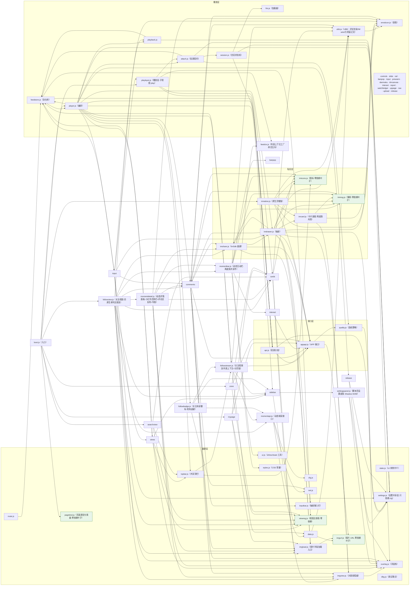

# AcFun 小视频 · PC 站竖刷页（油猴脚本）

在 **www.acfun.cn（PC 网页端）** 加入「小视频」入口，打开全屏抖音式竖滑信息流。
支持**双内容源**（竖刷页顶栏切换）：**小视频**（meow 接口，竖版短视频）与 **推荐**
（APP 首页推荐流，普通视频投稿，带弹幕/清晰度切换/收藏/投蕉），浏览与播放均**无需登录**。

## 安装

1. 浏览器安装 [Tampermonkey](https://www.tampermonkey.net/) 扩展；
2. 任选其一：
   - **直接安装**：打开 [最新版 acfun-svfeed.user.js](https://github.com/name-xxl/acfun-svfeed/releases/latest/download/acfun-svfeed.user.js)，
     Tampermonkey 会自动弹出安装页；
   - **手动**：新建脚本，把 `acfun-svfeed.user.js` 的内容整个粘贴进去保存（或把文件拖入浏览器安装）；
3. 打开 **A 站首页**（`www.acfun.cn/`），顶部导航会出现「小视频」项；
   若站点改版导致首页导航没注入成功，首页右下角会出现红色「▶ AcFun 小视频」悬浮按钮作为兜底入口。
   **入口只出现在首页**（0.9.47 起）：播放页、文章页等其他页面不注入、不弹胶囊；
   但分享链接 `#svfeed`（含带 meowId 的回跳链接）在**任意页面**打开仍可进入竖刷页。

> **更新检查授权提示（0.9.60 起）**：脚本会拉 GitHub 官方 `releases.atom` 做更新提示，
> 首次触发时 Tampermonkey 可能弹 **`github.com` 跨域授权确认，请点允许**——拒绝/漏点只影响
> 自动更新提示（debug 版可用 `acsv-stats` 的 `upd.check`/`upd.err` 计数自诊），其余功能不受影响。

## 使用

| 操作 | 效果 |
|---|---|
| 点击导航「小视频」/ 右下角悬浮按钮 | 打开竖刷页（地址变为 `www.acfun.cn/#svfeed`，可直接收藏） |
| 切换视频时 | 地址栏自动变为 `#svfeed/v/<meowId>`（小视频源）或 `#svfeed/a/<acId>`（推荐源）——`v`/`a` 段是**来源标记**：两种源的 id 来自不同详情表，带标记才能粘贴出去零歧义（不产生历史记录）。刷新或直接打开带 id 的链接（含 0.9.72 前的裸数字老链接）可回到同一条视频，并自动切到该条所属的内容源 |
| 鼠标滚轮 / ↑↓ / PgUp PgDn / J K / 右下角箭头 | 上一个 / 下一个视频（滚动吸附） |
| ← / →（短按） | 快退 / 快进 5 秒 |
| →（长按） | 2 倍速快进，松手恢复原速 |
| 点击画面 | 第一次点击开启声音，之后为播放/暂停 |
| 空格 | 播放 / 暂停 |
| M / 控制栏喇叭 | 静音切换 |
| F / 控制栏全屏按钮 | 全屏切换 |
| Esc | 逐层出栈：大图查看器 → 当前抽屉 → 当前视图/深界面 → 退出竖刷页。视图态 Esc=回竖刷；深界面（搜索结果页/播放层）Esc=回来源界面（打开它的那个列表） |
| 右上角 ✕ | **单一意义：退出脚本回首页**（0.9.74 起；普通界面的 Esc 另有语义，故两侧不再同义）——视图出口是常驻左栏 + Esc，深界面另在顶栏左缘出「向左返回」 |
| 悬停画面底部 | 浮出播放控制栏：可拖动进度条（带时间气泡）、播放/暂停、时间、连播、倍速、静音、全屏；鼠标静止 2.5 秒自动淡出 |
| 连播开关 | 开：播完自动下一条；关（默认）：单条循环 |
| 倍速菜单 | 展开菜单选 0.5x / 1.0x / 1.5x / 2.0x（按钮实时显示当前倍速） |
| 评论按钮 / C 键 | 展开右侧评论抽屉：真实评论列表（头像、UP 徽章、嵌套回复），头像和昵称可点击进入用户主页；切视频自动刷新，分页加载更多。**互动按源门控**：推荐模式可用底部输入栏**发表评论/回复/表情/插配图**、评论可**点赞**；小视频模式纯浏览（输入栏隐藏、点赞仅展示）。Esc 关闭顺序：大图查看器 → 抽屉 → 退出。**UBB 富文本**：表情、`[img]` 配图、`[color=#hex]` 着色均正常渲染；配图可**点击看大图**（点任意处/Esc 关闭）；**评论正文可划选复制**（右键原生复制）。**展开时视频画面等比缩放到剩余空间**（不裁画面，弹幕随画面），界面控件不缩放——底栏钉底收窄宽度，侧栏左移、顶栏整体收窄到抽屉左缘（右组贴边、居中搜索框回剩余区中心）；竖屏等满高可容的画面只平移不缩放（保持原始大小居中于剩余区域），窗口过窄（剩余空间 <50% 视口）时改纯覆盖：视频原尺寸继续播，抽屉近乎全遮，关闭即恢复。**同一套避让在榜单/我的/搜索视图同样生效**（0.9.73）：视图正文右缘收窄到抽屉左缘、网格自然重排，中窄视口退化为纯覆盖 |
| 右侧红心 | **真实点赞**：登录 A 站后直接生效（自动换取 api_st 令牌调互动接口）；未登录回退本地状态并提示 |
| 头像角标 +/✓ | **真实关注 / 取消关注** UP 主（需登录） |
| 分享 | **抖音式私信分享面板**：列出最近联系人（头像/昵称/未读数，可搜索），点「分享」直接把 `标题+链接` 发进对方私信；发送成功后按钮转「捎句话」，点击直达与该联系人的聊天；底部保留「复制链接」「消息中心」。需登录 A 站（走官方 ImSdk 私信通道，加载/连接失败自动降级为复制链接） |
| 顶栏信封（私信）/ **I 键** | **私信抽屉**（信封点第二遍即关、I 键全界面开合，0.9.75）：列表（联系人/未读/相对时间/搜索）↔ 聊天（气泡/**时间分割线**/**作品卡片**（封面/计数/时长，点击跳视频；自己发出的 `标题+链接` 分享消息同样渲染为卡片）/发送/失败点击重试/已读上报/**消息引用**（hover 引用按钮 → 引用 chip，摘要条点击定位高亮）/**表情收发**/**图片消息**（即拍即发、点击看大图）；自己气泡深蓝灰不刺眼）两视图；与评论抽屉**同槽互斥**（state.js 槽位协调：开一方自动收回另一方）；**视图态也可开**（0.9.73：抽屉盖在视图上，正文/顶栏按同一套避让让位）；Esc 逐层关：更新弹窗 → 大图查看器 → 当前抽屉 → 当前视图 → 退出 |
| 顶栏更新（信封旁） | **更新说明弹窗**：每次打开竖刷页自动检查一次新版本——更新后首次打开弹「vX 更新内容」（官方 release 渲染正文）；发现新版本首次弹「发现新版本」+ 说明 + [前往更新][忽略此版本]，此后仅 toast 轻提醒（红点亮至忽略或升级，忽略后该版本完全静默）；点按钮随时手动查看。数据取 GitHub 官方 `releases.atom`，拉取失败静默不打扰；Esc 关闭顺序：更新弹窗 → 大图查看器 → 抽屉 → 退出 |
| 打开 message.acfun.cn 私信 | **原生私信页自动增强**（装脚本即生效）：「不支持查看此消息」占位原位替换为 10001 作品卡；脚本分享消息渲染为紧凑作品卡（限宽 228px、封面裁切，原文只留附言）；引用消息补灰色摘要条并把正文剥成纯回复（与抽屉同观感，不再双份摘要）；会话列表预览改写「[分享] 标题」 |
| 顶栏搜索框（居中常驻，0.9.72；0.9.73 起四界面共用一个） | **搜 A 站视频**：Enter / 放大镜 → 搜索视图（`#svfeed/search/<关键词>`，可收藏/分享/刷新回放）——抖音式结果网格（封面左下播放数、右下时长，标题两行，底部 @UP·日期；点卡片进播放层就地播放（0.9.74：Esc/「向左返回」回来源）；**搜索视图里它就是唯一的输入框**（深链/换词时按地址回填，同词再回车就地重跑）；首屏结果外提供「去 A 站搜索页看全部」出口 |
| 左栏「我的」 | **个人主页**（`#svfeed/my`）：资料头（头像/昵称/关注·粉丝·投稿/签名，来源 `auth_key`→uid + `getUserCardList`；未登录或接口失败不显示头部）→ Tab（观看历史｜收藏夹，切换不重拉）→ **4:3 封面网格**（A 站普通视频封面固定 4:3，历史项封面左下角「观看至 xx:xx」角标，收藏显示 UP 名/续看秒数）；点卡片进播放层就地播放（Esc/「向左返回」回本列表），「加载更多」翻页 |
| 左栏「榜单」 | **分区榜单**（`#svfeed/zone`，0.9.69 全量对齐原生 rank/list）：渠道/子频道/榜期 chips（全站日榜 100 条）→ 1600 上限居中 rlist 分栏行（视频卡+UP 卡 338，0.9.70 起宽屏不留大空白）；封面 160×90、标题单行、简介 3 行（`<br>` 折行）、**meta 贴封面底**（原生图标：播放/评论/发布于·频道），排名=48px 旋转 10° 水印贴卡右下；UP 卡扁平+左竖线（头像 90/名字/签名 3 行/投稿·粉丝万格式图标位）；点行进播放层就地播放，整卡 UP 主页新窗 |
| 视图态顶栏（榜单/我的/搜索/播放层，0.9.73 四界面复用） | 与竖刷**同一套顶栏**：居中搜索框（搜索视图里它就是唯一输入框）+ 私信 / 更新 / ✕；源切换隐藏；**✕=退出脚本**（0.9.74 单一意义），搜索结果页与播放层在左缘多一个「向左返回」=回来源界面；私信 **I 键**四界面通用；抽屉开着时顶栏整体收窄到抽屉左缘（右组贴边、搜索框回剩余区中心，互不重叠） |

### 推荐模式（顶栏「小视频 | 推荐」切换，选择记忆）

数据来自 APP 首页推荐流（免登录），内容为普通视频投稿，交互对齐 APP：

| 操作 | 效果 |
|---|---|
| 顶栏「推荐」 | 切到 APP 首页推荐流（立即重置数据流并回到第一条；当前源在顶栏 seg 高亮，左栏 logo 常驻不随源变——0.9.64） |
| 右侧栏 | 点赞 / 评论 / **投蕉**（弹数量层：默认全灰，悬停第 N 根时 1~N 一起点亮，点第 N 根投 N；**投过即锁定变色**，状态由 `douga/info` 的 `isThrowBanana` 回填，A 站投蕉不可取消）/ 分享；赞/藏/蕉图标取视频页原生资源（CSS mask 换色，CDN 失败回退内置 SVG），评论/分享取小视频站原生 PNG（见下「操作栏图标」节） |
| 控制栏「弹」 | 弹幕开关（记忆状态）；Canvas 渲染，滚动/顶部/底部弹幕 + 轨道防重叠，暂停/seek/倍速自动正确 |
| 控制栏「发弹」 | 常驻内嵌胶囊输入框（Enter 发送、Esc 失焦，不折叠），发送到当前进度（网页 Cookie 鉴权需登录），成功后本地即时回显 |
| 控制栏清晰度 | 360P~1080P60 多档（m3u8 + hls.js——构建期内嵌，见下「说明与限制」），切换保留播放进度，档位记忆 |
| 控制栏「编码」 | 编码偏好：自动 / H.264（**默认**）/ HEVC。cast 档位不带编码字段，脚本从各档 m3u8 文件名嗅探（实测标记形如 `h264_60`/`h264_6m`）；默认滤掉 HEVC 档——部分 Chromium 无 HEVC 硬解，是 60fps 档卡帧主因；HEVC 档在清晰度菜单带 `·HEVC` 后缀；切换保留播放进度 |
| 控制栏「缓冲」 | 前向缓冲档位：标准 10s / **加大 20s（默认）** / 极限 30s（0.9.41 降流量），网络抖动更不易饿死；切换保留播放进度，档位记忆 |
| 右侧栏评论（C 键） | 评论入口（普通视频 sourceType=3），评论条目可点赞 |
| 播放直链链路 | ac号 → `douga/info` 拿 videoId → `playInfo/cast` 拿全档直链（http 强制转 https） |

界面设计借鉴快手网页版（new-reco）：封面模糊延伸的氛围背景、扁平白色图标操作栏、右下角切换箭头、悬停播放控制栏。

## UP 主空间页的小视频标签

在 `www.acfun.cn/u/<uid>` 空间页的内容标签栏（视频/文章/合辑）末尾自动加一个「小视频」标签
（PC 端空间本来不展示小视频），浏览体验对齐视频投稿标签：

- **自动加载**：后台按游标链顺序拉取该 UP 的小视频（每页 10 个、间隔 30ms 防压；默认最多自动拉 20 页，
  可在 `src/cfg.js` 的 `up.maxChainPages` 调整），左上角实时显示"已加载 N / 总数"，达到上限会明确提示；
- **页码分页浏览**：底部页码条（窗口式页码 + 省略号），未加载到的页码置灰，后台加载到即自动点亮；
- **最新 / 最热筛选**（右上角下拉，样式仿站点排序）：最新=接口顺序（时间倒序）；最热=逐个拉取
  meow/info 统计点赞数后重排（渐进完成，进度实时显示，切回最新恢复原序）；
- 点击封面直接以竖刷模式打开该视频（`#svfeed/v/<meowId>`），**后续按主页列表顺序**依次播放
  （空间页后台继续加载，列表追完后回落随机推荐流），Esc 退回空间页。

数据抓自 m 站 upPage 的 pagelet 接口（`userId&type=6&pcursor=<时间戳>`，返回 BigPipe HTML），
**必须在 Tampermonkey 下运行**（依赖 GM_xmlhttpRequest 跨域，浏览器直连会被 CORS 拦截）。
注意：接口本身不支持排序参数（实测 sort/order 均被忽略），最热排序为客户端统计实现。

## 说明与限制

- 接口：`POST https://m.acfun.cn/rest/mobile-direct/meow/feedList`（信息流）、
  `POST .../meow/info?meowId=<id>`（单视频详情，用于直链过期后刷新）、
  `GET https://www.acfun.cn/rest/pc-direct/comment/list?sourceId=<meowId>&sourceType=5`（评论列表，
  小视频在通用评论系统里的 sourceType 是 5，免登录；评论头像 headUrl 是 `[{cdn,url}]` 数组）。
  优先走 `GM_xmlhttpRequest`，未授权时回退 XHR（站点会重写 window.fetch，A 站包装器对部分 URL 会抛错）。
- 更新检查（0.9.60）：每次打开竖刷页查一次官方 `releases.atom`（与 @downloadURL 同域，
  60s 最小间隔防频繁进出刷请求），正文直接用 GitHub 官方渲染 HTML（不自研 markdown 渲染）；
  状态存 `localStorage['acsv-upd-v1']`（{seen,notified,ignored,lastCheck}）。拉取失败/未授权
  一律静默——GitHub 不可达意味着发布通道本身不可达，弹窗无意义。
- 操作栏图标：推荐模式的赞/藏/蕉用视频页原生图标做 CSS mask（借形状换色：未激活白色 →
  激活 A 站红 `--acsv-accent`，投过蕉锁定蕉黄）；小视频模式的赞用小视频站原生 PNG。
  评论/分享取自 AcFun 小视频页面自带资源（ali-imgs CDN 的 PNG）。内置 SVG 仅为
  CDN 资源加载失败时的回退。
- feedList 是随机推荐池（无翻页 cursor，m 站"下一条"也是同一接口、每批 5 条），脚本内按 `meowId`
  去重后拼接成无限流；刷新页面时若地址带深链（`#svfeed/v/<meowId>` 或 `#svfeed/a/<acId>`）则先加载
  该条并切到它所属的源，否则按源记忆重新随机。**深链解析失败会出错误盒，不会静默回落随机流**——
  0.9.72 前的老链接是裸数字 `#svfeed/<id>`（两种 id 空间语法同形），解析层会先按 meow 再按 ac 探测。
- 视频直链带签名（约 7 天有效），播放失败时自动换备用 CDN → 刷新详情 → 手动重试。
- **作者信息只有一个出口 `item.up{id,name,img,isFollowing}|null`（0.9.82）**：各来源只在自己
  的解析器里声明自家字段名（端点形状差异是事实，只压缩成一行映射），下游渲染/回填一律只读
  `up`；未知作者就是 `null`，渲染层**不挂作者行**、不编造占位名字（占位文案已由 eslint 禁令
  与 `test/unit/contract.test.js` 双重挡住）。各入口的作者来源：

  | 入口 | 作者来源 | 名字 | uid | 头像 |
  |---|---|---|---|---|
  | 首页推荐流 / 小视频流 | 卡片自带 `user`（`normalize`/`normalizeHome` 直读） | ✓ | ✓ | ✓ |
  | 站内搜索 | 搜索页 SSR 的 `.video__main__user`（`/u/<uid>` + `img.user-avatar`） | ✓ | ✓ | ✓ |
  | 我的·收藏 | `dougaList` 条目自带 `userName/userId/userImg`（docs §4.2 实测） | ✓ | ✓ | ✓ |
  | 分区榜单 | `rankList` 条目自带 `userName/userId/userImg` | ✓ | ✓ | ✓ |
  | 深链 → 小视频 | `meow/info` 回包 `user` | ✓ | ✓ | ✓ |
  | 深链 → ac 号 | `douga/info` 回包 `user`（`user.headUrl`，§3 实测） | ✓ | ✓ | ✓ |
  | 我的·观看历史 | `histories[].user`（与 APP 家族 user 同形状，§4.1 实测） | ✓ | ✓ | ✓ |

  即：**七条入口在面板层就带齐作者**，卡片首帧与播放层首帧都完整，且全程**零额外请求**——
  头像就在各来源自己的回包里（历史在 `histories[].user.headUrl`、深链在 `douga/info` 的
  `user.headUrl`），不必另调 `getUserCardList`。只有深链是"连卡片都没有"的入口，首帧要等
  那一发 `douga/info` 回来（这是它的固有形态，不是缺数据）。卡片脚行右槽与播放层日期槽的
  时间口径（0.9.85）：
  - **站方页面口径**（原生 UP 空间页/v 页）= 发布时刻 = `douga/info` 的 `createTimeMillis`。
    播放层左下日期槽（与竖刷推荐流每张卡）显示它，且**本地时区**格式化成 `YYYY-MM-DD`
    （顶层 `createTime` 只是展示串——旧稿 `2023-10-2`、近期 `24小时前`，不能当日期用）。
  - 历史卡右槽 = **观看时间**（`browseTime`）：三天内相对文案，更早带年份日期。
  - 收藏卡右槽 = **稿件上传时刻**（`dougaList.contentCreateTime`，与 `videoList[0].uploadTime`
    互证差 9 秒）。它与上面的"发布时刻"**可能差数天**（本稿差 5.16 天）——收藏列表接口不提供
    发布时刻，故按上传时刻显示，差异来源记在 `docs §4.2`。
- 每个小视频只有**单一档位**的直链（播放接口不提供清晰度切换）：清晰度取决于该视频上传时平台转出的源文件，
  新一些的视频多为 720p（横屏 1280×720 / 竖屏 720×1280），2018 年前后的老投稿常见 720×480。
  已实测 `meow/info` 与 `feedList` 对同一 ID 返回完全一致的 playInfo，无隐藏的高清参数；
  App 端 `api-new.app.acfun.cn/rest/app/meow/info` 需登录 api_st（未登录返回 result 105001）。
- 真实互动接口（需登录 www.acfun.cn）：
  点赞 = `POST id.app.acfun.cn/rest/web/token/get`（sid=acfun.midground.api，带 cookie）换 api_st →
  `POST api.kuaishouzt.com/rest/zt/interact/add|delete`（objectId=<meowId>&objectType=2&interactType=1&subBiz=mainApp&kpn=ACFUN_APP，成功返回 result=1）；
  关注 = `POST www.acfun.cn/rest/pc-direct/relation/follow`（toUserId&action=1/2，成功 result=0）。
  两接口 CORS 均放行 www.acfun.cn，页内 fetch 带 cookie 即可。
- 私信分享（需登录）：网页端私信**没有 REST 发送端点**，官方自己走快手 ImSdk
  （klink WebSocket + protobuf，CDN 地址取页面 `globalConfig.imsdkcdn`）。脚本加载 SDK 后
  `new ImSdk({dev:false})`——构造是单例，与站点顶栏未读红点实例共用同一条 WS 连接；
  鉴权 `POST id.app.acfun.cn/rest/web/token/get`（sid=acfun.midground.api，同点赞令牌），
  最近联系人 = `kernel.getSessions()`（按最近消息排序）+ `getUserCardList` 补头像昵称，
  发送 = `sendMessage(targetId, text)`（纯文本 ≤1000 字，成功有回调、失败无回调需超时兜底）。
  全链路任一步失败自动降级为复制链接。

### 推荐模式接口（api-new.app.acfun.cn，与 acfunchina.com 同后端互通）

- 首页流：`POST /rest/app/selection/feed?product=ACFUN_APP&app_version=6.31.1.1026&appMode=0`，
  body `mkey=<固定token>&pcursor=<游标>&count=10`；**必须带 APP 请求头**
  （acPlatform=ANDROID_PHONE、appVersion、productId=2000、udid、requestTime 等，UA 用
  `acvideo core/...` 设备格式），缺了报 result 21；selection/feed 必须带 appVersion 头，
  douga/playInfo 不带。mkey 是客户端硬编码 token，免登录免签名。
- 详情：`GET /rest/app/douga/info?dougaId=<ac号>&mkey=` → `videoList[].id` 即 videoId，
  附 channel（发弹幕的 subChannelId/Name 取 channel.parentId/parentName）、全套计数、
  isLike/isFavorite 初始状态。
- 播放：`GET /rest/app/play/playInfo/cast?videoId=&resourceId=<ac号>&resourceType=2&mkey=` →
  streams[] 按清晰度降序（1080P60…360P，各 2 个 CDN），playUrls 为 http m3u8，
  前缀直接换 https 可用（实测 200）；Chromium 需 hls.js——0.9.14 起构建期内嵌进产物（无 CDN 依赖、不吃页面 CSP），内嵌缺失时才逐源拉
  CDN 文本 + Function 兜底（npmmirror 优先）；Safari 走原生 HLS。streams[] 不带编码字段，且每档是单变体 media playlist
  （无 #EXT-X-STREAM-INF 变体），编码维度只体现在 m3u8 文件名标记里（如 `h264_60`/`h264_6m`），
  脚本据此嗅探并支持按偏好过滤档位（`cfg.codec`）。
- 弹幕：全量 `POST www.acfun.cn/rest/pc-direct/new-danmaku/list`
  （resourceId=<videoId>&resourceType=9&pcursor=1&count=200，网页 Cookie，pcursor 翻页）；
  发送 `POST www.acfun.cn/rest/pc-direct/new-danmaku/add`
  （body/color/mode=1/position=<ms>/id=<ac号>/videoId/subChannelId/subChannelName/type=douga）。
- 收藏/投蕉/评论点赞：全部走 **PC 端点 + 网页 Cookie**（0.9.30 前后逐一实测改定，APP 端点已弃）——
  收藏 `POST www.acfun.cn/rest/pc-direct/favorite/resource/add|remove`（**resourceType=9**（收藏体系
  专用枚举，2→9 由 acfunsdk 显式映射）且必须带 `addFolderIds/delFolderIds` 落进收藏夹；此前调
  APP 端 `/rest/app/favorite` 服务端回 result:0 但实际不入库）、投蕉
  `POST www.acfun.cn/rest/pc-direct/banana/throwBanana`（resourceType=2&count 1~5）、评论点赞
  `POST www.acfun.cn/rest/pc-direct/comment/like|unlike`（无需 token）。
- 弹幕 mode：1=滚动、4=底部、5=顶部；颜色为十进制 int（16777215=白色），position 为毫秒。

## 冻结归因实验（0.9.7+，仅 debug 构建）

「最小化回来画面冻结、音频正常」的归因用控制变量法：**同一浏览器同一视频，每轮只改一个条件**，
跑 7 轮最小化往返（等 30 秒再回来），记录冻/不冻。实验开关写入 `localStorage['acsv-exp']` 后
重开信息流生效（清除：`localStorage.removeItem('acsv-exp')`）：

| 轮次 | 操作 | 验证什么 |
|---|---|---|
| 0 对照 | A 站主站播放页打开同一视频，同样最小化往返 | 坐实差异在脚本栈 |
| 1 基线 | debug 版默认设置 | 复现冻结 |
| 2 锁档 | 清晰度菜单手动锁 720P（`_qManual` 置位） | 顶配/60fps 解码负载因素 |
| 3 `{"q30":1}` | 滤掉 60fps 档 | 同上（不动 `_qManual`） |
| 4 `{"noMonitor":1}` | 跳过看门狗 | 顶针/rME/降档动作本身致冻 |
| 5 `{"noWorker":1}` | 关 hls.js 转封装 worker | worker 后台往返问题 |
| 6 `{"smallBuf":1}` | 缓冲缩到 std 档 | 大缓冲内存压力因素 |
| 7 `{"native":1}` | 强制走原生 HLS（MSE 可用时默认一律 hls.js） | 0.9.12 定因轮：Edge 原生 HLS 管线缺陷（已定案，开关保留备查） |

读数（控制台，TM 下请用第二种）：
```js
__ACSV_TEST__.getStats()                          // 页内/harness 环境可用
JSON.parse(localStorage.getItem('acsv-stats'))    // TM 环境兜底（debug 版每秒镜像，取 .stats 字段）
```
- `vis.framesBackMs`：回前台到首个真实帧的耗时。**反复 >2000ms = 真楔死**（看门狗该出手）；
  **反复 <1000ms 却仍判冻 = 监视器误判（脚本锅实锤）**；
- `hls.levelCodec`：实际播放编码（avc/hevc + fps）——确认有无 HEVC 泄漏；
- `stall.tailReattach`/`session.dispose` 增长 = 看门狗在自救。

判定：`q30`/锁档有效 → 顶配解码负载（后续改默认档策略）；`noMonitor` 有效 → 看门狗动作致冻；
`noWorker` 有效 → worker 问题；`smallBuf` 有效 → 内存压力；全无效且 `framesBackMs` 大 →
环境级（GPU/驱动/Chromium 版本），脚本无责收尾。

## 更新日志

完整更新日志见 [CHANGELOG.md](CHANGELOG.md)——每个版本一节（病灶 / 修法 / 测试证据），
最新在前；改版本时同步自己的小节（`test/check-release.mjs` 会校版本号与小节一致）。

## 开发

源码按模块拆在 `src/`（ES 模块），构建打包成单文件油猴脚本：

```
npm install          # 安装开发依赖（esbuild/eslint/playwright）与 hls.js（运行时依赖，构建期内嵌进产物）
npm run build        # 产出 acfun-svfeed.user.js + acfun-svfeed.debug.user.js
npm run watch        # 监听 src/ 变更自动重建
npm test             # 静态一致性校验 + 单测 + 无头 harness 全场景（需先 npx playwright install chromium，
                     #   没装时本机自动回退系统 Edge）
npm run check        # 仅三项静态校验（CI 在 build 后跑）：场景登记双向对齐 / 版本号-产物-CHANGELOG
                     #   三者一致 / 依赖图不缺边
```

测试设施（0.9.81 工程化）：
- `test/cases/*.js`——harness 场景体（7 个文件按域拆分：feed/stall/views/play/deeplink/upd/msg），
  `test/harness.html` 只留公共件与分发器（~200 行）；场景里加断言改 cases 文件，新增场景记得
  同步 `run-harness.mjs` 的 HARNESS_CASES（双向漏登记由 `test/check-cases.mjs` 拦截）。
- `test/run-harness.mjs`——无头驱动：标 `serial: true` 的场景（时序判定敏感的帧间隔/冻结窗口类）
  串行独占，其余两两并发（夹具计数按 `pid` 隔离）；`ONLY` 传未知名会直接报错退出。
- 依赖图、CHANGELOG、产物版本三者与代码的一致性由 `test/check-*.mjs` 静态保证（CI 必过）。

#### 发布（Release）

1. push `main` → CI（`.github/workflows/build.yml`）必须全绿：lint / build / **产物与源码同步**
   （`git diff --exit-code` 两个 bundle）/ `npm run check` / 单测 / harness 全场景。
2. 版本号已是 `package.json` 的值（`test/check-release.mjs` 校 package.json ↔ 两个产物的 `@version`
   ↔ CHANGELOG 小节三者一致），CHANGELOG 里该小节必须已写好。
3. `gh release create v<版本> acfun-svfeed.user.js acfun-svfeed.debug.user.js --title ... --notes ...`
   —— 标签体例 `v0.9.85`；标题体例 `v0.9.85 · <主旨短语>（<起始版本>-<末版本>）`（一次发多个未发布
   版本时，正文写**整段区间**的用户向总结，参考 v0.9.81 那条）。
4. **正文必须显式写明下载哪个文件**——`.debug` 版是调试构建（多埋点、部分行为不同），
   下载记录里真出现过误下（v0.9.81：正式版 3 次 / debug 1 次）。正文首段固定放一句：
   > **下载认准 `acfun-svfeed.user.js`**（Tampermonkey 里可直接安装）；
   > `acfun-svfeed.debug.user.js` 是调试构建，不是给日常使用的版本。
5. 发完自检：`https://github.com/name-xxl/acfun-svfeed/releases/latest/download/acfun-svfeed.user.js`
   能拿到新版本号（脚本的 `@updateURL`/`@downloadURL` 就指这里，更新提示读 `releases.atom`）。

| 模块 | 职责 |
|---|---|
| `cfg.js` | 常量表（接口地址、APP 请求头/固定 mkey、timings、导航标签） |
| `net.js` | `request(url, method, headers, body)`：GM_xmlhttpRequest 优先、XHR 回退 |
| `data.js` | 双 normalize：meow（kind=sv）与 selection 卡片（kind=home）→ 同一字段契约；面板条目契约（panelItem 解析器表）与搜索 SSR 解析（parseSearchItems）；**作者契约 up（0.9.82 统一条目模型）**：`upOf` 定型 + `playItemOf` 面板→播放的桥（纯函数）+ `ITEM_FIELDS` 字段白名单；**时间文案（0.9.85）**：`fmtDate`（本地时区 YYYY-MM-DD，禁 UTC 口径）+ `fmtAgo`（三天内相对、更早带年份）+ `relTime`（榜单「发布于xx」，对齐原生原样保留） |
| `api.js` | 接口封装 + 内容源状态（getSource/setSource）+ feed/refresh 按源分发（mock 桩收口在这） |
| `appapi.js` | APP 家族接口层：selection feed（游标）、douga/playInfo 懒解析、收藏/投蕉/评论点赞、弹幕 list/add、api_st 令牌（播放档位策略已剥离到 quality.js） |
| `quality.js` | 播放质量策略（零网络）：编码偏好过滤 HEVC/AVC、清晰度记忆选档；appapi 取档、它选档 |
| `feedstore.js` | 信息流数据仓库（游标泵，空间页列表上下文按序泵入；home 条目允许空 urls 懒解析） |
| `route.js` | `#svfeed[/v|a/<id>]`、`#svfeed/play/<v|a>/<id>`（0.9.74 播放层：view=play + src 标记、**不填 mid**）路由解析、地址栏同步与深链意图（appliedMid/cancelHashSync） |
| `state.js` | `root`/`scroller`/`commentDrawer` 跨模块 UI 单例（player 赋值，他人只读） |
| `styles.js` / `ui.js` | CSS、图标；`el`/`esc`/`fmt`/`toast`/剪贴板/样式注入等工具 |
| `imgurl.js` | 图片 URL 纯逻辑层（0.9.76，零 import 叶子）：`coverUrl` 归一（http→https/实体解码/query 一律保留）+ `coverAttempts` 失败重试链决策（三跳两两换 URL）+ `memoState`/`memoTrim` 死链备忘纯判定（0.9.77：只读不续期）——URL 正确性只在这里定义 |
| `imgload.js` | 图片加载执行层（0.9.76；0.9.77 头注校准覆盖边界）：项目图片字段（封面/头像）统一入口——`IMG_POLICY` 策略表（grid/thumb/avatar/space）+ `imgInto(host,url,policy[,cls])`（懒加载/重试链/终败降级/淡入/死链备忘）+ `lazyObserve` 观察器单例（私信气泡共用）。有意在外的例外：鉴权 blob 管线（imshare）、UBB/表情 HTML、站点静态图标、大图查看器 |
| `interact.js` | 真实点赞/关注（api_st → interact 接口）；收藏/投蕉转发 AppAPI |
| `comments.js` | 评论抽屉（sourceType 按 item.stype 分发 5/3/4、楼中楼、分页、评论点赞；UBB/表情/大图查看器/输入栏已拆出）。0.9.96 管线 **host 化**：DOM 宿主显式化（默认=抽屉单例，动态详情面板灌入同款三元组），`openCommentsHost`/`closeCommentsHost` 为面板入口，输入条三件套随宿主迁移 |
| `ubb.js` | 评论 UBB 渲染：esc-first 管线，[emot]/[at]/[resource]/[img]/[color] 逐一白名单放行；IM wire 文本投影（ubbImText）与引用块富正文（ubbQuoteHtml）单源 |
| `emoticon.js` | 表情包服务 + 面板 + 输入栏表情按钮挂载（localStorage 缓存优先、最近使用、分包 tab） |
| `imgview.js` | 配图大图查看器（评论/私信共用；root 单例浮层、Esc 模态） |
| `inputbar.js` | 抽屉输入栏 builder（评论/私信共用：表情/图片按钮、自动增高、Enter/Esc；差异语义参数注入） |
| `upload.js` | 评论图片上传四阶段（GM 通道二进制分片，失败统一落 null） |
| `hls.js` | hls.js 加载（0.9.14 起构建期内嵌：window.Hls 首检命中；CDN 逐源文本+Function 仅兜底；Safari 原生 HLS 探测） |
| `dmcanvas.js` | Canvas 弹幕渲染层（无状态重绘：每帧按 video.currentTime 反推位置；滚动轨道分配；DPR 对齐） |
| `danmaku.js` | 弹幕编排：列表拉取/缓存、开关记忆、绑定/解绑 slide、发送输入条 |
| `player.js` | 播放器编排层：renderWindow 窗口扫描、setActive、顶栏源高亮同步、挂载/卸载、SESSION_HOOKS 注入、观看历史触发；0.9.79 播放层直达不预热竖刷（feedDeferred/maybeStartFeed） |
| `session.js` | 播放会话：video 生命周期/懒解析等待/hls 实例与锁档/错误恢复链（换 CDN→重解析→重挂）/HealthMonitor（冻结/慢放检测与恢复阶梯），dispose 一次拆净 |
| `attach.js` | 重挂统一入口 attachVideo + switchQuality；slide._xxx 与 dataset 投影的跨模块契约总表（唯一登记点） |
| `playback.js` | 播放/声音原语与手势：播放/暂停/静音手势合并实现、_userPaused 暂停意图、幽灵音频清扫 |
| `controls.js` | 控制栏：进度条（拖动/时间气泡）、清晰度/编码/缓冲菜单（buildMenu）、连播/倍速/静音/全屏、前向邻位重建 |
| `rail.js` | 右侧操作栏（赞/蕉/藏/评/分享/关注）：乐观更新+失败回滚、原生图标 CSS mask 换色、计数回填钩子、分享面板入口 |
| `slide.js` | buildSlide/buildDrawer：slide 骨架与评论抽屉骨架（commentDrawer 赋值点）、scroll 归零防护；点按判定对 data-ovl（播放层）免「当前条」检查 |
| `input.js` | 键盘/全屏/幽灵扫描：翻页、快进快退、长按 2x、Esc 优先级链（更新弹窗→大图查看器→抽屉→退出）、幽灵视频扫描；**I=私信抽屉开合**（0.9.75，模态门禁与输入框豁免之后、视图门禁之前——视图/播放层也生效） |
| `report.js` | 观看历史上报：与官方事件流对齐（0.9.86 实测——暂停即报/播完/离开，无心跳），页内走官方 SDK 队列，关页 sendBeacon 直发官方同款信封（0.9.87 嗅探+续号）、同秒位去重；播放中账本落盘 + 启动对账补报（崩溃出口，误差≤3s） |
| `watchledger.js` | 观看上报纯逻辑层（0.9.87）：持久账本 reconcile（TTL/账平/容量/单调守卫）、上报参数与直发信封构造——node --test 直测，环境触点留在 report.js |
| `prewarm.js` | 预热：索引稳定 500ms 后预解析 cur+1/2、媒体域动态 preconnect（上限 6 + 静态种子） |
| `dbg.js` | 调试埋点（仅 debug 构建存活）：stat 计数、testHook、`acsv-stats` localStorage 镜像 |
| `nav.js` / `uppage.js` | 导航入口注入；UP 主空间页小视频标签 |
| `imshare.js` | 私信基建：ImSdk 加载器（源码补丁 + Blob 执行）、连接/发送确认（轮询式恢复链）、内核直发（引用/图片消息，clientSeqId 对账）、图片字节拉取（midground 令牌 + LRU 缓存/并发限 3/在飞去重）、用户卡片、分享面板 |
| `imdrawer.js` | 私信抽屉（列表/聊天两视图、乐观气泡、未读徽标、消息引用双 wire、表情/图片收发渲染；卡片装配自 0.9.80 走 `imcard.js` 共享层——只留暗色皮肤声明）；分享消息卡片化（dougaCard 拉详情原位补全）；0.9.75：列表↔会话改「双向平移」（舞台 .acsv-im-stage 裁剪 + 两面板 .acsv-im-pane 叠加，状态类 .chat-on，时长走 --acsv-dw-t 单源）、`toggleImDrawer`（信封/ I 键开合，关闭分支先于登录门槛） |
| `imnative.js` | 原生私信页增强（message.acfun.cn）：占位替换（10001 卡，unsafeWindow 读页面内核）+ 分享卡 + 引用消息渲染（去重加固）+ Shadow DOM 隔离（0.9.80：卡片装配与抽屉同源，只留浅色皮肤声明） |
| `imcard.js` | 私信卡片装配（0.9.80，两皮肤共用）：视频卡=封面+计数条+两行标题、评论卡=引用块+来源小条；共享"load 才放出/error 隐藏"时序、[img] 看图、dougaCard 原位 patch（信封双皮肤：抽屉暗色 `.acsv-im-*` / 原生页浅色 Shadow） |
| `immsg.js` | 私信消息共享解析层（parseCard/parseShare 容忍式契约、引用解析 quoteOf/quoteExtraOf/isQuotable、评论转发 wire 组装与识别/拆分、extra 载荷 key 常量、预览映射/降级文案），双端渲染器各自消费 |
| `imicons.js` | 站点原生图标登记表（CDN SVG + 字形码点，双端共享） |
| `release.js` | 更新提示（0.9.60）：官方 releases.atom 拉取/解析纯函数（cmpVersion/normVer/parseRelAtom/latestEntry/decideUpd）+ 说明弹窗单例 + 红点；正文直接用 GitHub 官方渲染 HTML（elHtml 信任契约）；每次 mount 检查一次（60s 节流）、失败静默、unmount 显式拆监听 |
| `overlay.js` | 浮层栈（0.9.61）：Esc 显式分支链的收拢（overlayOpen/Close/Top/IsOpen/Teardown，close 回调注册方自带、先出栈再调+异常隔离）；modal 键语义单监听承载（release/imgview capture 自关退役）；栈=显式状态（0.9.22 精神延续） |
| `views.js` | 子视图框架（0.9.62；0.9.74 来源保活）：#svfeed/&lt;view&gt;/&lt;arg&gt; 路由宿主（注册表自 0.9.78 独立为 viewreg.js）、竖刷保活（scroller 隐藏+暂停，返回恢复播放）、**深界面（def.deep）来源链 + 来源视图挂起保活**（非 volatile：换类名 acsv-view-held + visibility 挂起，回来原位复原；同屏换参替换链顶）；卡面 kit 与点击出口注入缝自 0.9.109 拆出（→ cards.js，本模块只管编排） |
| `cards.js` | 卡面 kit（0.9.109 自 views.js 拆出，逐字搬运零逻辑改动）：网格卡 gridCardOf / 行卡 rowOf / 资源横条 stripOf / 引用卡 quoteBlockOf / UP 卡 upCardOf / 计数行 statRowOf / 骨架 skeletonRows / 加载更多 moreBtn 单源；点击出口注入缝（setItemOpener/openPanelItem/setMomentOpener，注册方 playlayer/followview）——本模块不反向 import 播放层/详情面板。消费方：mypage/zone/searchview/followview/momentdetail/playlayer |
| `sidebar.js` | 左栏 dock（0.9.62；0.9.78 起条目从 viewreg 的 dock 元数据派生——此前是第二份人工清单，加视图要改两处）：「推荐」+ 各视图入口，当前视图高亮，窄屏隐藏，随 unmount 拆除 |
| `viewreg.js` | 视图注册表（0.9.78，零依赖叶子）：`registerView`/`viewDef`/`dockEntries`——视图清单的唯一真源；dock 元数据（label/svg/order/group）随视图声明，sidebar 只读派生 |
| `topbar.js` | 共享顶栏（0.9.72 抽离；0.9.73 四界面复用；0.9.74 ✕ 单一意义+向左返回）：搜索框（居中常驻；视图态按地址关键词回填，搜索视图经 setSearchHandler 挂载期接管提交、teardown 还原）+ 左缘「向左返回」（仅深界面，onBack hooks）+ 右侧按钮组（源切换/私信/更新/退出，行为 hooks 注入不反向 import player）；syncTopbar(view,arg,{deep})：**✕ 永远=退出脚本**（普通界面 Esc 另义），深界面出返回键 |
| `searchview.js` | 搜索视图（0.9.72；0.9.73 并入共享顶栏；0.9.74 deep+suspend/resume）：搜索页 SSR HTML 区段解析（data.parseSearchItems）→ 抖音式结果网格卡；关键词唯一真源=地址栏，顶栏搜索框即其唯一输入框 |
| `playlayer.js` | 播放层（0.9.74；0.9.82 面板→播放的桥下沉为 data.playItemOf 纯函数）：子视图 play（#svfeed/play/&lt;v\|a&gt;/&lt;id&gt;）就地播放——面板条目即时首帧（标题/封面/作者来自面板契约的 up：搜索与收藏来源带作者，历史来源不带、由回包补）/ 冷进入 API.deepLink 解析（不 setSource）/ 失败错误盒+重试；OVL_IDX 哨兵 + data-ovl 判据（attach.js 契约表在册）、键盘重定向 state.setVideoTarget |
| `mypage.js` | 我的视图（0.9.62；0.9.69 抖音式）：资料头（auth_key→uid + getUserCardList 契约 meCardOf，缺省不渲染）+ Tab 惰性面板（观看历史=双 resourceTypes/pageNo 翻页；收藏夹=chips 切夹→dougaList 翻页）+ 4:3 封面网格卡（普通视频封面口径）；条目经 panelItem 契约规整、点击进播放层（0.9.74） |
| `zone.js` | 分区榜单视图（0.9.62；0.9.66 对齐原生：子频道行+UP 卡；0.9.79 首屏 5 分钟缓存）：渠道/子频道/榜期 chips + GET rank/channel；contentType 过滤在契约层 |
| `followview.js` | 关注视图「全部」侧（0.9.100 原生骨架复刻；0.9.101 交互补课；0.9.102 收口）：单列无限流——**逐段复刻原生 /member/feeds 骨架与量取值**（扁平列表+灰带分隔、头像 50、名字 16px、60px 内容缩进、正文 14/21 pre-line+展开、九宫格 342/110/299/228、横条双灰块+title 600+时长 hover 浮层、互动行 48px/42/12px、图标四件套逐码点采样；量取日与暗色换算表在 styles 段头注）；互动行写链（乐观回滚；点赞文章只读；**投蕉**：动态=单蕉直投、视频/文章=视频页同款数量层 banpop.js「点第 N 根投 N」、已投锁定蕉黄 #ffb323；pi 级写路径单源=interact.likePi/throwBananaPi）；**评论键原位展开评论区**（全类型：动态 stype=4/视频 stype=3，comments 管线 host 化挂行内，开新关旧互斥）；**引用卡完全照原生**（@源UP 蓝链 + 内嵌完整源内容卡，复用 stripOf；三落点可点）；无限滚动五条借鉴广场 + **回顶按钮（0.9.105 顶栏同款圆钮+chevUp）**；**作者名蓝链**（与引用卡同源）；互动栏/分享出口走 **momentbar 共享件**（分享 place=右缘贴行左缘 12px、底部共用坐标）。视频行进播放层，动态行点详情面板，文章行外链 |
| `followstream.js` | 关注语境「视频」侧（0.9.99）：FollowVideos 列表上下文（UpVideos 通道先例）——followDougaFeed 后台分页链（§2.1.2：固定 10/页、终页 no_more）→ 深链 `svfeed/a/<acId>` 接管宿主竖刷舞台 → feedstore 泵按列表灌入（`ctx.info` 自带 home 家族 resolve，非 m3u8 直链绕 hls）；`isFollowContext()` 是顶栏 seg 显隐与徽标不点亮的单源判据；enterVideos 原地续看不重置缓冲 |

| `feedctx.js` | 列表上下文工厂（0.9.106）：`createFeedContext`（8 核心字段+reset 单源，UpVideos/FollowVideos 同源生成）+ `runChain`（链式加载状态机单源：上限/间隔/done/failed/chainCapped 判定一处）+ **注册表单活互斥**（activateContext 清其余——空间页/关注视频流互踩修复） |
| `momentapi.js` | 动态域读接口（0.9.106 收口；0.9.107 unreadCount 退役）：listMoments（followFeedV2）/listVideos（followDougaFeed，规整走契约层 followVideoPageOf）/momentPageUrl；URL 形态逐字保持（mock 缝）；评论管线/写链不入（边界登记） || `momentdetail.js` | 动态详情面板（0.9.96 起；0.9.103 小红书式两栏；0.9.105 轮播+共存）：按内容型换布局——有 imgs（**图像权威=imgs**，0.9.105）两栏（左媒体黑底台 / 右 `.acsv-mdetail-side` 400）+**多图轮播**（track translate3d/60×60 箭头/底点/滚轮 preventDefault 逐格，XHS 实测 2026-10-04），无图/转发单栏 min(620px)；✕ 浮卡片外右上；正文 16/24；评论标题「共 N 条评论」（comments 管线 titleFmt）；互动栏（momentbar 共享件 skin=detail 四键）留内容底部；管线 host.el 两栏态指右栏（stype=4）；**不占 claimDrawer 槽**（私信抽屉共存+acsv-with-comments 左移避让，0.9.105）。**光 DOM 有意偏离 intake**（评论 CSS 单源，登记在模块头）；与评论抽屉共用 overlay 'comments' 层位 |
| `momentbar.js` | 动态互动栏共享件（0.9.105）：行流卡与详情面板同键定义表（分享/评论/蕉/赞）+ 写链编排单源（乐观回滚/投蕉锁/动态单蕉/视频文章数量层），skin 分皮肤（尺寸/类名由 CSS 按根类作用域）；键出口经 opts 注入（行流=原位评论+place 分享；面板=滚动聚焦评论+右贴分享） |
| `followbadge.js` | 关注未读徽标（0.9.97；**0.9.107 改时间水位线**）：徽标=自水位 `acsvFollowSeenAt`（GM，无 GM 内存降级）以来 followFeedV2 首屏 `createTime > 水位` 的新条数——旧 webPush followUpers 布尔是服务端长期不清标记（实测清不掉⇒固定数字复亮），已退役；**进关注语境期间 poll 自持推进水位**（看过即已读、离开不复亮）；退避真逐次翻倍 60s→10min 纯函数；hidden 短路/未登录静默；挂 player.mount/unmount |
| `boot.js` | 启动入口（构建 entry）：按 `pagekind.js` 分类分流——原生私信页只跑消息增强；首页全量初始化（样式先就位）；`/u/<数字>` 页加空间页注入；其余 www 页仅基础设施（不无条件注入全量 CSS，挂载时自持）。路由监听全 www 保留（任何页面粘 `#svfeed` 深链都能进竖刷） |
| `pagekind.js` | 页面类型分类器（0.9.88，零依赖叶子）：`pageKind({hostname,pathname})` → native/home/video/article/member/other——boot 运行分流的唯一判据（判据与 uppage 的 `/u/\d+` 逐字一致，单测钉一致性） |
| `settings.js` | 设置共享层（0.9.89，零 UI，只许 import cfg——eslint 定向禁令守着）：SCHEMA 是唯一契约（两皮肤表驱动同源），存储逐键 `acsv.s.<key>`（GM 优先/LS 回落、写防抖、无 TTL——偏好不是缓存，理由在模块头）＋六项老偏好首读收养（老键不删）；`onChange` 订阅让消费方零反向依赖地即时生效 |
| `settingspanel.js` | 脚本页设置皮肤（0.9.89）：dock 齿轮 → `openSettings()` → overlay 栈（modal，Esc 白拿）；host + **Shadow DOM** 作用域样式（量取值与日期在文件头注释）；控件按 schema 表驱动（bool 开关 / select 下拉 / number 步进器）；原生页皮肤 Phase 6 是兄弟模块 |

### 模块依赖图

由 src 静态 `import` 生成，并与 `test/check-deps.mjs` 双向校验（CI 必过；改 import 后跑 `npm run check`）。两条「满连接」不画箭头以免糊成一团：
`cfg.js` 被全部模块引用；`styles.js`/`ui.js`（CSS 与 `el`/`esc`/`toast` 工具）被几乎全部 UI 模块引用；
`dbg.js` 仅调试构建存活（正式构建被 define 死码消除）。



绿色五个节点是刻意的解耦点：`immsg.js`/`imicons.js`/`imgurl.js`/`pagekind.js`/`viewreg.js` 零 import，消费方各自引入
（`immsg` 现为 imdrawer/imnative/imshare 三方），私信格式与图片 URL 规则变更只改各自一处；
`pagekind` 零依赖是为 boot 与单测都能直采（含 `location` 的 boot 不可单测，判据必须抽纯）；
图片加载面（懒加载/重试/降级）统一走 `imgload.js`——新图面加一行 `imgInto`，别再手拼
`referrerPolicy`/`loading`（`uppage` 在 others 组内，同引 imgload）。
0.9.41 起评论/私信的**输入栏（`inputbar.js`）与大图查看器（`imgview.js`）**同为共用件，
两抽屉观感/行为单一来源。
`player.js → attach.js → session.js` 的反向回调（qualitySwitch/reattach）不走 import，
经 `setSessionHooks` 注入（见 `player.js` 头注释）——这是全项目唯一的钩子注入点；
`state.js` 单例中介的存在就是为了切断 player 与只读方之间的循环 import。
上图只画主要结构边，次要工具型 import（`cfg`/`styles`/`ui`/`dbg` 的满连接）归入分组节点不逐条画。


`acfun-svfeed.debug.user.js` 与正式版出自同一源码，仅 `__ACSV_DEBUG__` 注入值不同：
调试版在 `window.__dbg` 记录启动埋点（iife-start / cfg-ok / mount-enter / root-appended / toggle），
正式构建中被死码消除，运行行为一致。改动只在 `src/` 里做，不要手改两个 `.user.js`（构建产物）。

## 本地开发预览

```
npm run build
node -e "…任意静态服务器…"   # 或 npx serve
# 打开 http://127.0.0.1:8137/test/harness.html
```

`test/harness.html` 使用 `test/feed-sample.js`（真实 meow 快照）、`test/home-sample.js`
（真实 selection/feed 卡片快照 + 本地测试视频）与 `test/my-sample.js`（视图接口快照）+ 
`test/state-spy.js`（状态观察钩子）做 mock，可以在不装 Tampermonkey 的情况下调试
界面与交互逻辑；加 `?src=home` 直接进入推荐模式。场景体在 `test/cases/*.js`（0.9.81 起，
按域拆分），页内只做分发。
注意 harness 的 mock 分支会绕过真实接口 URL 拼接，接口地址类 bug 在本地预览里测不出来。
